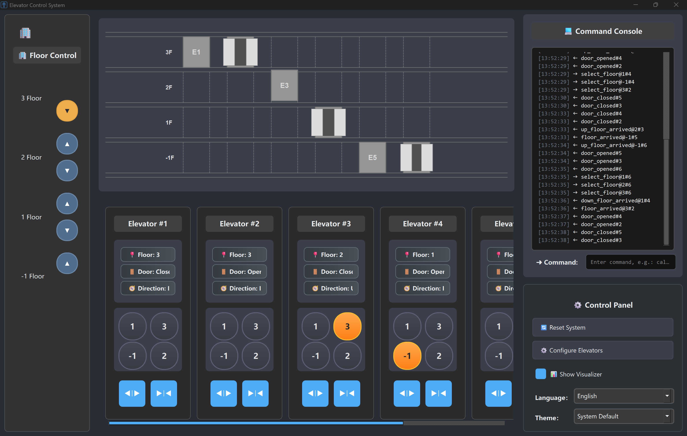

# 🏢 Advanced Elevator Control System

A modern multi-elevator simulation platform with async architecture, real-time GUI, internationalization support, and comprehensive testing.

## 📋 Table of Contents

- [🚀 Features](#-features)
- [📸 Screenshots](#-screenshots)
- [🚀 Getting Started](#-getting-started)
  - [Installation](#installation)
  - [Quick Start](#quick-start)
- [📖 Usage Guide](#-usage-guide)
  - [GUI Mode](#gui-mode)
  - [Headless Mode](#headless-mode)
  - [Testing Framework](#testing-framework)
- [🎮 Interactive Features](#-interactive-features)
- [🌐 ZeroMQ API](#-zeromq-api)
- [🏗️ System Architecture](#️-system-architecture)
  - [Elevator States](#elevator-states)
  - [Dispatch Algorithms](#dispatch-algorithms)
- [📁 Project Structure](#-project-structure)
- [🔧 Configuration Reference](#-configuration-reference)
- [📄 License](#-license)

## 🚀 Features

### Core Capabilities

- **Async Architecture**: Built with `asyncio` and `qasync` for non-blocking operations
- **Multi-Elevator Control**: Intelligent dispatch algorithms (OPTIMAL, GREEDY) with state machines
- **Real-Time GUI**: 2D elevator animation with Qt6
- **Theme Support**: Light/dark mode with OS preference detection
- **Internationalization**: Chinese/English support with runtime language switching
- **Network Communication**: ZeroMQ for distributed testing and control
- **Comprehensive Testing**: Unit, integration, and system tests

### Key Components

- **Event-Driven Core**: `asyncio.Event` and `asyncio.Queue` for inter-component communication
- **State Machines**: Explicit elevator states (Moving Up/Down, Door Opening/Closing, Stopped)
- **Live Animations**: Smooth 2D elevator and door animations
- **Dynamic Configuration**: Runtime parameter updates without restart

## 📸 Screenshots

Here's what the Advanced Elevator Control System looks like in action:

### Main Interface (Dark Theme)



_The main interface featuring real-time elevator visualization, floor controls, and status indicators in dark theme mode._

## 🚀 Getting Started

### Installation

**Requirements:**

- Python 3.13+
- Dependencies: PySide6/PyQt6, pyzmq, qasync, qtpy, rich, tornado, aioconsole

```shell
# Clone and setup
git clone https://github.com/xsjk/Elevator.git
cd Elevator
uv sync
```

### Quick Start

```shell
# Launch GUI mode (recommended for first-time users)
uv run -m system

# Launch headless mode for testing/automation
uv run -m system --headless

# Run test suite
uv run -m testing --all
```

## 📖 Usage Guide

### GUI Mode

Launch the full graphical interface with real-time elevator visualization:

```shell
# Default configuration (2 elevators, 5 floors)
uv run -m system

# Custom configuration
uv run -m system --num-elevators 4

# Debug mode with faster timing
uv run -m system --floor-travel-duration 0.5 --log-level DEBUG
```

**Features:**

- Real-time 2D elevator animation
- Interactive floor calling and destination selection
- Theme switching (light/dark mode)
- Language switching (English/Chinese)
- Live configuration adjustments

### Headless Mode

Run core elevator logic without GUI for testing and automation:

```shell
# Basic headless mode
uv run -m system --headless

# Production-like configuration
uv run -m system --headless --num-elevators 8
```

**Use Cases:**

- Automated testing and CI/CD
- Performance benchmarking
- Server deployment without display
- Integration with external systems via ZeroMQ

### Testing Framework

Comprehensive test suite with interactive runner:

```shell
# Interactive test selection
uv run -m testing

# Run all tests in parallel
uv run -m testing --all

# Run specific tests with limited concurrency
uv run -m testing --tests test_controller.py --max-workers 4

# Use unittest discover for automatic test discovery (sequential)
uv run -m unittest discover -s testing -p test_*.py
```

**Test Categories:**

- **Unit Tests**: Individual component testing
- **Integration Tests**: Multi-component interaction testing
- **Performance Tests**: Load and stress testing
- **Passenger Simulation**: Realistic usage scenarios

## 🎮 Interactive Features

### GUI Controls

- **Call Elevators**: Click floor buttons to call elevators up/down
- **Select Destinations**: Click destination floor buttons inside elevators
- **Change Theme**: Toggle between light/dark themes in real-time
- **Switch Language**: Choose between English and Chinese interfaces
- **Adjust Settings**: Modify elevator count and timing parameters live

### Test Runner Interface

- **Test Selection**: Choose specific tests by number (e.g., "1 3 5")
- **Real-time Progress**: Live updates showing test status and results
- **Detailed Output**: View detailed logs for failed tests
- **Concurrent Execution**: Run multiple tests simultaneously

## 🌐 ZeroMQ API

The system provides a comprehensive ZeroMQ interface for external integration and testing.

### Server Setup

```shell
# Start ZeroMQ test server
uv run -m testing.server

# Connect with elevator system (in another terminal)
uv run -m system --headless
```

### User Operations

- **Door Control**

  - `open_door#1` - Open doors of elevator #1
  - `close_door#2` - Close doors of elevator #2

- **Floor Calling**

  - `call_up@1` - Call elevator from floor 1 going up
  - `call_down@3` - Call elevator from floor 3 going down

- **Destination Selection**

  - `select_floor@2#1` - Go to floor 2 in elevator #1

- **System Control**
  - `reset` - Reset elevator system to initial state

### System Events

- **Door Events**

  - `door_opened#1` - Doors of elevator #1 opened
  - `door_closed#1` - Doors of elevator #1 closed

- **Floor Arrival Events**
  - `up_floor_1_arrived#1` - Elevator #1 arrived at floor 1 going up
  - `down_floor_2_arrived#2` - Elevator #2 arrived at floor 2 going down
  - `floor_1_arrived#1` - Elevator #1 stopped at floor 1

**Available Parameters:**

- Elevators: `#1`, `#2`
- Floors: `-1` (basement), `1`, `2`, `3`
- Call up floors: `-1`, `1`, `2`
- Call down floors: `3`, `2`, `1`

## 📁 Project Structure

```text
Elevator/
├── src/
│   ├── system/                       # Core Application
│   │   ├── __main__.py               # Entry point
│   │   ├── core/                     # Business Logic
│   │   │   ├── controller.py         # Elevator dispatch
│   │   │   └── elevator.py           # Elevator state machine
│   │   ├── gui/                      # User Interface
│   │   │   ├── main_window.py        # Main window
│   │   │   ├── visualizer.py         # 2D animations
│   │   │   ├── theme_manager.py      # Theme system
│   │   │   └── i18n.py               # Internationalization
│   │   └── utils/                    # Utilities
│   │       ├── event_bus.py          # Event system
│   │       └── zmq_async.py          # ZeroMQ communication
│   ├── testing/                      # Test Suite
│   │   ├── __main__.py               # Test runner
│   │   ├── server.py                 # ZMQ test server
│   │   └── test_*.py                 # Unit tests
│   └── model_checking/               # UPPAAL Model Checking
│       ├── elevator.xml              # Elevator model
│       └── sub_user.xml              # User model
├── docs/                             # Documentation
│   ├── user_manual/                  # User Manual
|   |   ├── user_manual.md            # Markdown version
│   │   └── user_manual.pdf           # PDF version
│   ├── requirement/                  # Requirements
│   │   ├── requirements.md           # Markdown version
│   │   └── requirements.pdf          # PDF version
│   ├── specification/                # Specification
│   │   ├── specification.md          # Markdown version
│   │   └── specification.pdf         # PDF version
│   ├── validation/                   # Validation
│   │   ├── validation.md             # Markdown version
│   │   └── validation.pdf            # PDF version
│   └── traceability/                 # Traceability
│       ├── traceability.md           # Markdown version
│       └── traceability.pdf          # PDF version
├── README.md                         # Project Overview
├── LICENSE                           # Project License
├── pyproject.toml                    # Project Metadata
└── uv.lock                           # Dependency Lockfile
```

## 🔧 Configuration Reference

### Command-Line Arguments

#### Main System (`uv run -m system`)

| Argument                  | Type   | Default | Description                                           |
| ------------------------- | ------ | ------- | ----------------------------------------------------- |
| `--headless`              | flag   | false   | Run without GUI interface                             |
| `--log-level`             | string | INFO    | Logging level (DEBUG, INFO, WARNING, ERROR, CRITICAL) |
| `--num-elevators`         | int    | 2       | Number of elevators in the building                   |
| `--floor-travel-duration` | float  | 3.0     | Time (seconds) for elevator to travel between floors  |
| `--door-move-duration`    | float  | 1.0     | Time (seconds) for door to open/close                 |
| `--door-stay-duration`    | float  | 3.0     | Time (seconds) door stays open                        |

#### Testing Framework (`uv run -m testing`)

| Argument        | Type | Default | Description                                 |
| --------------- | ---- | ------- | ------------------------------------------- |
| `--all`         | flag | false   | Run all tests without interactive selection |
| `--tests`       | list | []      | Specific test files to run                  |
| `--max-workers` | int  | 16      | Maximum concurrent test processes           |

### Elevator States

The system implements a comprehensive state machine with six distinct states defined in `ElevatorState`:

- **`MOVING_UP`**: Elevator traveling upward between floors
- **`MOVING_DOWN`**: Elevator traveling downward between floors
- **`STOPPED_DOOR_CLOSED`**: Elevator stationary with doors fully closed (idle state)
- **`STOPPED_DOOR_OPENED`**: Elevator stationary with doors fully open for boarding/alighting
- **`OPENING_DOOR`**: Doors in the process of opening
- **`CLOSING_DOOR`**: Doors in the process of closing

**Initial State**: All elevators start in `STOPPED_DOOR_CLOSED` state on floor 1.

### Dispatch Algorithms

- **OPTIMAL**: Minimizes total wait time across all passengers with reassignment
- **GREEDY**: Prioritizes elevator for each request with faster response times

## 📄 License

This project is licensed under the MIT License.

---

<div align="center">

**Built with ❤️ by CS132 Students**

[📚 Documentation](./docs/) • [🐛 Report Bug](./issues/) • [💡 Request Feature](./issues/) •

</div>
