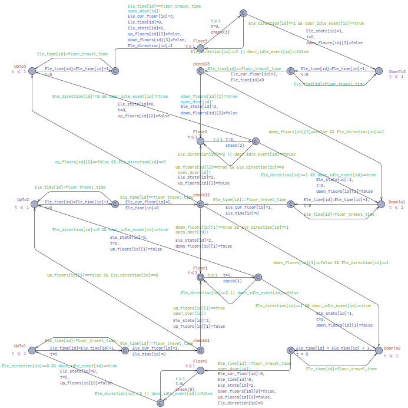
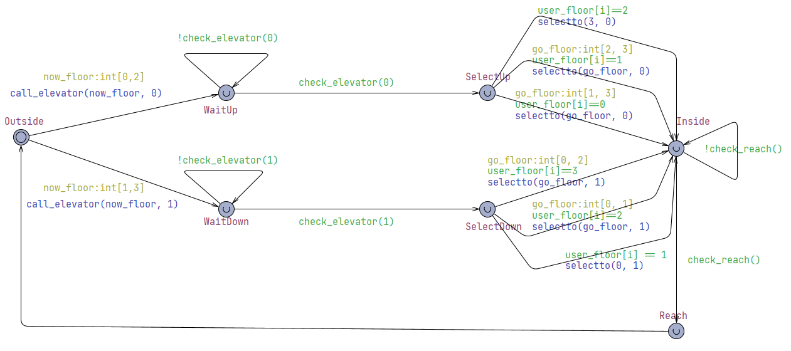
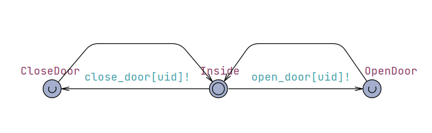

# Elevator Validation
**Group 3**  
**Author: Yi Huang**  

## Table of Contents
- [Testing](#testing)  
    - [Code Running](#code-running)
    - [T1: Unit Test](#t1-unit-test)
        - [T1.1 Controller Unit Test](#t11-controller-unit-test)
        - [T1.2 Elevator Unit Test](#t12-elevator-unit-test)
        - [T1.3 TargetFloors Unit Test](#t13-targetfloors-unit-test)
        - [T1.4 TargetFloorsChains Unit Test](#t14-targetfloorchains-unit-test)
        - [T1.5 Floor Unit Test](#t15-floor-unit-test)
        - [T1.6 GUIController Unit Test](#t16guicontroller-unit-test)
    - [T2: Integration Test](#t2-integration-test)
        - [T2.1 Integration Test 1](#t21-integration-test1)
        - [T2.2 Integration Test 2](#t22-integration-test2)
    - [T3: System Test](#t3-system-test)
- [Model Checking](#model-checking)  
    - [Full Uppaal Model](#full-model)
    - [Properties](#verification-queries)
- [Risk Management](#risk-management) 

# *Testing*

## Code Running

### Environment Setup
- Python: **3.13** needed

To run all the testing code, you can run the command 
```
python -m testing
```

## T1: Unit Test
This section provides information of the unit tests we made.

### T1.1: Controller Unit Test

#### T1.1.1: Test reset()

```
    async def reset(self):
        await self.stop()

        # Empty the queue
        while not self.queue.empty():
            self.queue.get_nowait()

        # Reset elevators
        self.__post_init__()

        self.start()

        logger.info("Controller: Elevator system has been reset")
```
- Coverage Criteria: Branch coverage
- Test cases

|    | Test Case T1.1.1.1 | 
|---|---|
| Coverage Item   | Tcover1.1.1.1 |
| Input    |  | 
| State    | self.queue not empty |
| Expected Output | self.queue empty |

- Test coverage: 1 / 1 = 100%
- Test result: 1 passed

#### T1.1.2: Test handle_message(message: str)

```
    async def handle_message(self, message: str):
        if message == "reset":
            await self.reset()

        elif message.startswith("call_up@") or message.startswith("call_down@"):
            direction = Direction.UP if message.startswith("call_up") else Direction.DOWN
            floor = Floor(message.split("@")[1])
            await self.call_elevator(floor, direction)

        elif message.startswith("select_floor@"):
            parts = message.split("@")[1].split("#")
            floor = Floor(parts[0])
            elevator_id = int(parts[1])
            await self.select_floor(floor, elevator_id)

        elif message.startswith("open_door#"):
            elevator_id = int(message.split("#")[1])
            elevator = self.elevators[elevator_id]
            await self.open_door(elevator)

        elif message.startswith("close_door#"):
            elevator_id = int(message.split("#")[1])
            elevator = self.elevators[elevator_id]
            await self.close_door(elevator)

        elif message.startswith("deselect_floor@"):
            parts = message.split("@")[1].split("#")
            floor = Floor(parts[0])
            elevator_id = int(parts[1])
            await self.deselect_floor(floor, elevator_id)

        elif message.startswith("cancel_call_up@") or message.startswith("cancel_call_down@"):
            direction = Direction.UP if message.startswith("cancel_call_up") else Direction.DOWN
            floor = Floor(message.split("@")[1])
            await self.cancel_call(floor, direction)

        else:
            logger.warning(f"Controller: Unrecognized message '{message}'")
```

- Coverage Criteria: Branch coverage
- Test cases

|    | Test Case T1.1.2.1 | Test Case T1.1.2.2 |
|---|---|---|
| Coverage Item   | Tcover1.1.2.1 | Tcover1.1.2.2 |
| Input    | "call_up@2" | "call_down@3" |
| State    |  |  |
| Expected Output | controller.elevators[1].current_floor = 2 | self.controller.elevators[1].current_floor = 3 |

|    | Test Case T1.1.2.3 | Test Case T1.1.2.4 |
|---|---|---|
| Coverage Item   | Tcover1.1.2.3 | Tcover1.1.2.4 |
| Input    | "call_up@2" "cancel_call_up@2" | "call_down@3" "cancel_call_down@3" |
| State    |  |  |
| Expected Output | len(self.controller.requests) = 0 | len(self.controller.requests) = 0 |

|    | Test Case T1.1.2.5 | Test Case T1.1.2.6 |
|---|---|---|
| Coverage Item   | Tcover1.1.2.5 | Tcover1.1.2.6 |
| Input    | "select_floor@2#1" | "select_floor@2#1" "deselect_floor@2#1" |
| State    |  |  |
| Expected Output | controller.elevators[1].current_floor = Floor("2") | "select_floor@2#1" not in controller.message_tasks |

|    | Test Case T1.1.2.7 | Test Case T1.1.2.8 |
|---|---|---|
| Coverage Item   | Tcover1.1.2.7 | Tcover1.1.2.8 |
| Input    | "open_door#1" | "close_door#1" |
| State    |  |  |
| Expected Output | controller.elevators[1].door_open = True | controller.elevators[1].door_open = False |

|    | Test Case T1.1.2.9 |  |
|---|---|---|
| Coverage Item   | Tcover1.1.2.9 |  |
| Input    | "foobar@unknown" |  |
| State    |  |  |
| Expected Output | Nothing |  |

- Test coverage: 9 / 9 = 100%
- Test result: 9 passed

#### T1.1.3: Test call_elevator(call_floor: FloorLike, call_direction: Direction)

```
    async def call_elevator(self, call_floor: FloorLike, call_direction: Direction):
        call_floor = Floor(call_floor)
        assert call_direction in (Direction.UP, Direction.DOWN)

        # Check if the call direction is already requested
        if (call_floor, call_direction) in self.requests:
            logger.info(f"Controller: Floor {call_floor} already requested {call_direction.name.lower()}")
            return

        logger.info(f"Controller: Calling elevator: Floor {call_floor}, Direction {call_direction.name.lower()}")

        # Choose the best elevator (always choose the one that takes the shorter arrival time)
        enabled_elevators = [e for e in self.elevators.values() if e.started]
        if not enabled_elevators:
            logger.warning(f"Controller: No enabled elevators available for call at Floor {call_floor} going {call_direction.name.lower()}")
            return

        elevator = min(enabled_elevators, key=lambda e: e.estimate_arrival_time(call_floor, call_direction))
        logger.info(f"Controller: Elevator {elevator.id} selected for call at Floor {call_floor} going {call_direction.name.lower()}")
        directed_target_floor = FloorAction(call_floor, call_direction)

        try:
            self.requests.add(directed_target_floor)
            await elevator.commit_floor(call_floor, call_direction).wait()
            event_bus.publish(Event.CALL_COMPLETED, call_floor, call_direction)
        except asyncio.CancelledError as e:
            if str(e) != "cancel":
                raise asyncio.CancelledError from e
        finally:
            self.requests.remove(directed_target_floor)
            elevator.cancel_commit(call_floor, call_direction)
```

- Coverage Criteria: Branch coverage
- Test cases

|    | Test Case T1.1.3.1 |  
|---|---|
| Coverage Item   | Tcover1.1.3.1 | 
| Input    | (Floor("2"), Direction.UP) | 
| State    |  | 
| Expected Output | self.controller.elevators[1].current_floor = 2 | 

- Test coverage: 1 / 1 = 100%
- Test result: 1 passed

#### T1.1.4: Test select_floor(floor: FloorLike, elevator_id: ElevatorId)

```
    async def select_floor(self, floor: FloorLike, elevator_id: ElevatorId):
        floor = Floor(floor)

        elevator = self.elevators[elevator_id]
        if elevator.started is False:
            logger.warning(f"Controller: Elevator {elevator_id} is not enabled, cannot select floor {floor}")
            return

        # Check if the floor is already selected
        if floor in elevator.selected_floors:
            logger.info(f"Controller: Floor {floor} already selected for elevator {elevator_id}")
            return

        try:
            elevator.selected_floors.add(floor)
            await elevator.commit_floor(floor, Direction.IDLE).wait()
            event_bus.publish(Event.FLOOR_ARRIVED, floor, elevator_id)
        except asyncio.CancelledError as e:
            if str(e) != "deselect":
                raise asyncio.CancelledError from e
        finally:
            elevator.selected_floors.remove(floor)
            elevator.cancel_commit(floor, Direction.IDLE)
```

- Coverage Criteria: Branch coverage
- Test cases

|    | Test Case T1.1.4.1 |
|---|---|
| Coverage Item   | Tcover1.1.4.1 | 
| Input    | (Floor("3"), 1) |
| State    |  | 
| Expected Output | self.controller.elevators[1].current_floor = Floor("3") | 

- Test coverage: 1 / 1 = 100%
- Test result: 1 passed

#### T1.1.5 Test open_door(elevator: Elevator)

```
    async def open_door(self, elevator: Elevator):
        await elevator.commit_door(DoorDirection.OPEN)
```
- Coverage Criteria: Branch coverage
- Test cases

|    | Test Case T1.1.5.1 |
|---|---|
| Coverage Item   | Tcover1.1.5.1 | 
| Input    |  |
| State    | elevator = self.controller.elevators[1] | 
| Expected Output | self.controller.elevators[1].door_open = True | 

- Test coverage: 1 / 1 = 100%
- Test result: 1 passed

#### T1.1.6 Test close_door(elevator: Elevator)

```
    async def close_door(self, elevator: Elevator):
        await elevator.commit_door(DoorDirection.CLOSE)
```
- Coverage Criteria: Branch coverage
- Test cases

|    | Test Case T1.1.6.1 |
|---|---|
| Coverage Item   | Tcover1.1.6.1 | 
| Input    |  |
| State    | elevator = self.controller.elevators[1] | 
| Expected Output | self.controller.elevators[1].door_open = False | 

- Test coverage: 1 / 1 = 100%
- Test result: 1 passed

### T1.2: Elevator Unit Test

#### T1.2.1 Test accelerate_distance()

```
    def accelerate_distance(self) -> float:
        return 0.5 / self.floor_travel_duration * self.accelerate_duration

```
- Coverage Criteria: Branch coverage
- Test cases

|    | Test Case T1.2.1.1 | 
|---|---|
| Coverage Item   | Tcover1.2.1.1 |
| Input    |  | 
| State    |  |
| Expected Output | 0.5 |

- Test coverage: 1 / 1 = 100%
- Test result: 1 passed

#### T1.2.2 Test max_speed()

```
    def max_speed(self) -> float:
        return 1.0 / self.floor_travel_duration
```
- Coverage Criteria: Branch coverage
- Test cases

|    | Test Case T1.2.2.1 | 
|---|---|
| Coverage Item   | Tcover1.2.2.1 |
| Input    |  | 
| State    |  |
| Expected Output | 1.0 |

- Test coverage: 1 / 1 = 100%
- Test result: 1 passed

#### T1.2.3 Test acceleration()

```
    def acceleration(self) -> float:
        return self.max_speed / self.accelerate_duration
```
- Coverage Criteria: Branch coverage
- Test cases

|    | Test Case T1.2.3.1 | 
|---|---|
| Coverage Item   | Tcover1.2.3.1 |
| Input    |  | 
| State    |  |
| Expected Output | 1.0 |

- Test coverage: 1 / 1 = 100%
- Test result: 1 passed

#### T1.2.4 Test commit_door(door_state: DoorDirection)

```
    async def commit_door(self, door_state: DoorDirection):
        if not self.door_loop_started:
            logger.warning(f"door_loop of elevator {self.id} was not started yet.")
        self.door_action_queue.put_nowait(door_state)  # the queue is consumed at door_loop
        self.door_action_processed.clear()
        await self.door_action_processed.wait()
```
- Coverage Criteria: Branch coverage
- Test cases

|    | Test Case T1.2.4.1 | 
|---|---|
| Coverage Item   | Tcover1.2.4.1 |
| Input    | (DoorDirection.OPEN) | 
| State    |  |
| Expected Output | elevator.door_open = True |

- Test coverage: 1 / 1 = 100%
- Test result: 1 passed

#### T1.2.5 Test commit_floor(floor: FloorLike, requested_direction: Direction = Direction.IDLE)

```
    def commit_floor(self, floor: FloorLike, requested_direction: Direction = Direction.IDLE) -> asyncio.Event:
        """
        Commit a floor to the elevator's list of target floors.

        Args:
            floor (Floor): The floor to commit. Must be an instance of Floor.
            requested_direction (Direction): The direction the elevator should take after arriving at the floor. If Direction.IDLE, it is a call inside the elevator

        Returns:
            asyncio.Event: An event that will be set when the elevator arrives at the committed floor.

        """
        floor = Floor(floor)

        if not self.move_loop_started:
            logger.warning(f"move_loop of elevator {self.id} was not started yet.")

        logger.debug(f"Elevator {self.id}: Committing floor {floor} with direction {requested_direction.name}")

        directed_floor = FloorAction(floor, requested_direction)
        if directed_floor in self.target_floor_chains:
            logger.debug(f"Elevator {self.id}: Floor {floor} with direction {requested_direction.name} already in the action chain")
            return self.events[directed_floor]

        assert isinstance(requested_direction, Direction)

        target_direction = self.direction_to(floor)

        # arrive immediately if the elevator is already at the floor
        if target_direction == Direction.IDLE:  # same floor
            if self.target_floor_chains.direction in (requested_direction, Direction.IDLE):  # same direction
                msg = f"floor_arrived@{self.current_floor}#{self.id}"
                match requested_direction:
                    case Direction.UP:
                        self.queue.put_nowait(f"up_{msg}")
                    case Direction.DOWN:
                        self.queue.put_nowait(f"down_{msg}")
                    case Direction.IDLE:
                        self.queue.put_nowait(msg)

                e = asyncio.Event()

                async def open_door():
                    try:
                        await self.commit_door(DoorDirection.OPEN)
                    except asyncio.CancelledError:
                        pass
                    e.set()

                self.event_loop.create_task(open_door(), name=f"open_door_elevator_{self.id}_floor_{floor} {__file__}:{inspect.stack()[0].lineno}")
                logger.debug(f"Elevator {self.id}: Arrived at floor {floor} immediately, opening door")
                return e

        # Determine the chain to add the action to and process later in the move_loop
        match self.target_floor_chains.direction:
            case Direction.IDLE:
                # Use the current chain
                chain = self.target_floor_chains.current_chain
                # Initialize the direction of the chain
                self.target_floor_chains.direction = requested_direction if requested_direction != Direction.IDLE else target_direction
            case Direction.UP | Direction.DOWN:
                match requested_direction:
                    case Direction.IDLE:
                        if target_direction in (self.target_floor_chains.direction, Direction.IDLE):
                            chain = self.target_floor_chains.current_chain
                        else:
                            chain = self.target_floor_chains.next_chain

                    case Direction.UP | Direction.DOWN:
                        if requested_direction == self.target_floor_chains.direction:
                            if target_direction in (self.target_floor_chains.direction, Direction.IDLE):
                                # We can directly reuse the current plan since the all directions are the same
                                chain = self.target_floor_chains.current_chain
                            else:
                                # The floor has missed although the requested direction is the same as the current direction
                                # We need to add it to the last plan
                                chain = self.target_floor_chains.future_chain
                        else:
                            # Add the floor to the next plan since it is in the opposite direction
                            chain = self.target_floor_chains.next_chain

        # Add the action to the chain
        chain.add(floor, requested_direction)
        logger.debug(f"Elevator {self.id}: {self.target_floor_chains}")

        self.events[directed_floor] = asyncio.Event()
        return self.events[directed_floor]

```
- Coverage Criteria: Branch coverage
- Test cases

|    | Test Case T1.2.5.1 | Test Case T1.2.5.2 |
|---|---|---|
| Coverage Item   | Tcover1.2.5.1 | Tcover1.2.5.2 |
| Input    | (2, Direction.IDLE) | (2, Direction.UP) |
| State    | elevator.current_floor = 2 | elevator.current_floor = 2, elevator.target_floor_chains.direction = Direction.UP|
| Expected Output | elevator.door_open = True | elevator.door_open = True |

|    | Test Case T1.2.5.3 | Test Case T1.2.5.4 |
|---|---|---|
| Coverage Item   | Tcover1.2.5.3 | Tcover1.2.5.4 |
| Input    | (2, Direction.DOWN) | (3, Direction.DOWN) |
| State    | elevator.current_floor = 2, elevator.target_floor_chains.direction = Direction.DOWN | elevator.current_floor = 1, elevator.target_floor_chains.direction = Direction.IDLE|
| Expected Output | elevator.door_open = True | elevator.target_floor_chains.direction = Direction.DOWN, FloorAction(3, Direction.DOWN) in elevator.target_floor_chains.current_chain|

|    | Test Case T1.2.5.5 | Test Case T1.2.5.6 |
|---|---|---|
| Coverage Item   | Tcover1.2.5.5 | Tcover1.2.5.6 |
| Input    | (3, Direction.UP) | (1, Direction.UP) |
| State    | elevator.current_floor = 2, elevator.target_floor_chains.direction = Direction.UP | elevator.current_floor = 2, elevator.target_floor_chains.direction = Direction.UP|
| Expected Output | FloorAction(3, Direction.UP) in elevator.target_floor_chains.current_chain | FloorAction(1, Direction.UP) in elevator.target_floor_chains.current_chain|

|    | Test Case T1.2.5.7 | 
|---|---|
| Coverage Item   | Tcover1.2.5.7 |
| Input    | (1, Direction.UP) | 
| State    | elevator.current_floor = 2, elevator.target_floor_chains.direction = Direction.DOWN |
| Expected Output | FloorAction(1, Direction.UP) in elevator.target_floor_chains.current_chain | 

- Test coverage: 7 / 7 = 100%
- Test result: 7 passed

#### T1.2.6 Test cancel_commit(floor: FloorLike, requested_direction: Direction = Direction.IDLE)

```
    def cancel_commit(self, floor: FloorLike, requested_direction: Direction = Direction.IDLE):
        floor = Floor(floor)
        directed_floor = FloorAction(floor, requested_direction)
        # Remove the action from the chain
        logger.debug(f"Elevator {self.id}: Cancelling floor {floor} with direction {requested_direction.name}")
        logger.debug(f"Elevator {self.id}: {self.target_floor_chains}")
        if directed_floor in self.target_floor_chains:
            self.target_floor_chains.remove(directed_floor)
            assert directed_floor in self.events
            self.events.pop(directed_floor).set()
            logger.debug(f"Elevator {self.id}: {self.target_floor_chains}")
```
- Coverage Criteria: Branch coverage
- Test cases

|    | Test Case T1.2.6.1 | 
|---|---|
| Coverage Item   | Tcover1.2.6.1 |
| Input    | (4, Direction.UP) | 
| State    | elevator.commit_floor(4, Direction.UP) |
| Expected Output | event.is_set() = True |

- Test coverage: 1 / 1 = 100%
- Test result: 1 passed

#### T1.2.7 Test arrival_summary(floor: FloorLike, requested_direction: Direction)

```
    def arrival_summary(self, floor: FloorLike, requested_direction: Direction) -> tuple[float, int]:
        floor = Floor(floor)
        directed_floor = FloorAction(floor, requested_direction)
        if directed_floor not in self.target_floor_chains:
            raise ValueError(f"Floor {floor} not in action chain")

        current_floor = self.current_position

        n_floors = 0.0
        n_stops = 0
        for a in iter(self.target_floor_chains):
            n_floors += abs(a.floor - current_floor)
            if a.floor == floor and a.direction in (requested_direction, Direction.IDLE):
                break
            n_stops += 1

            current_floor = a.floor

        return n_floors, n_stops
```
- Coverage Criteria: Branch coverage
- Test cases

|    | Test Case T1.2.7.1 | 
|---|---|
| Coverage Item   | Tcover1.2.7.1 |
| Input    | (5, Direction.UP) | 
| State    | elevator.current_floor = 1, elevator.commit_floor(5, Direction.UP) |
| Expected Output | n_floors = 4.0, n_stops = 0 |

- Test coverage: 1 / 1 = 100%
- Test result: 1 passed

#### T1.2.8 Test estimate_door_close_time()

```
    def estimate_door_close_time(self) -> float:
        """
        Estimate the time until the door finally closes.

        Returns:
            float: Estimated time in seconds until the door is fully closed.
        """
        duration: float = 0.0
        if self._door_last_state_change_time is None:
            return duration
        passed = self.event_loop.time() - self._door_last_state_change_time

        match self.state:
            case ElevatorState.OPENING_DOOR:
                duration = self.door_move_duration - passed + self.door_stay_duration + self.door_move_duration
            case ElevatorState.STOPPED_DOOR_OPENED:
                duration = self.door_stay_duration - passed + self.door_move_duration
            case ElevatorState.CLOSING_DOOR:
                duration = self.door_move_duration - passed
        if duration < 0:
            duration = 0.0
        return duration

```
- Coverage Criteria: Branch coverage
- Test cases

|    | Test Case T1.2.8.1 | Test Case T1.2.8.2 | 
|---|---|---|
| Coverage Item | Tcover1.2.8.1 | Tcover1.2.8.2 |
| Input |  |  |
| State | elevator._door_last_state_change_time = self.elevator.event_loop.time() - 1.0, elevator.state = ElevatorState.OPENING_DOOR | elevator._door_last_state_change_time = self.elevator.event_loop.time() - 1.0, elevator.state = ElevatorState.STOPPED_DOOR_OPENED |
| Expected Output | 8.0 | 5.0 |

|    | Test Case T1.2.8.3 | 
|---|---|
| Coverage Item   | Tcover1.2.8.3 |
| Input    |  | 
| State    | elevator._door_last_state_change_time = self.elevator.event_loop.time() - 1.0, elevator.state =  ElevatorState.CLOSING_DOOR |
| Expected Output | 2.0 |

- Test coverage: 3 / 3 = 100%
- Test result: 3 passed

#### T1.2.9 Test estimate_door_open_time()

```
    def estimate_door_open_time(self) -> float:
        """
        Estimate the time until the door fully opened (including the stay duration).

        Returns:
            float: Estimated time in seconds until the door is fully closed.
        """
        duration: float = self.door_move_duration
        if self._door_last_state_change_time is None:
            assert self.state == ElevatorState.STOPPED_DOOR_CLOSED
            return duration

        passed = self.event_loop.time() - self._door_last_state_change_time
        match self.state:
            case ElevatorState.OPENING_DOOR:
                duration = self.door_move_duration - passed
            case ElevatorState.STOPPED_DOOR_OPENED:
                duration = 0
            case ElevatorState.CLOSING_DOOR:
                duration = passed + self.door_stay_duration
            case _:
                raise ValueError(f"Invalid elevator state {self.state.name} for estimating door open time")
        if duration < 0:
            duration = 0.0
        return duration

```
- Coverage Criteria: Branch coverage
- Test cases

|    | Test Case T1.2.9.1 | Test Case T1.2.9.2 | 
|---|---|---|
| Coverage Item | Tcover1.2.9.1 | Tcover1.2.9.2 |
| Input |  |  |
| State | elevator._door_last_state_change_time = self.elevator.event_loop.time() - 1.0, elevator.state = ElevatorState.OPENING_DOOR | elevator._door_last_state_change_time = self.elevator.event_loop.time() - 1.0, elevator.state = ElevatorState.STOPPED_DOOR_OPENED |
| Expected Output | 2.6 | 0 |

|    | Test Case T1.2.9.3 | 
|---|---|
| Coverage Item   | Tcover1.2.9.3 |
| Input    |  | 
| State    | elevator._door_last_state_change_time = self.elevator.event_loop.time() - 1.0, elevator.state =  ElevatorState.CLOSING_DOOR |
| Expected Output | 3.4 |

- Test coverage: 3 / 3 = 100%
- Test result: 3 passed

#### T1.2.10 Test pop_target()

```
    def pop_target(self) -> FloorAction:
        """
        Pop the next action from the elevator's list of target floors.
        """
        if self.target_floor_chains.is_empty():
            raise IndexError("No actions in the current chain")

        directed_floor = self.target_floor_chains.pop()
        event = self.events.pop(directed_floor)
        event.set()
        logger.debug(f"Elevator {self.id}: Action popped: {directed_floor}")
        logger.debug(f"Elevator {self.id}: {self.target_floor_chains}")
        return directed_floor
```
- Coverage Criteria: Branch coverage
- Test cases

|    | Test Case T1.2.10.1 | Test Case T1.2.10.2 | 
|---|---|---|
| Coverage Item | Tcover1.2.10.1 | Tcover1.2.10.2 |
| Input |  |  |
| State | target_floor_chains.is_empty() = True | elevator.commit_floor(3, Direction.IDLE) |
| Expected Output | raise error | FloorAction(3, Direction.IDLE) |

- Test coverage: 2 / 2 = 100%
- Test result: 2 passed

#### T1.2.11 Test _move_loop()

```
    async def _move_loop(self):
        """
        Main loop for the elevator. This function will be called in a separate async task.

        It really updates `self.current_floor`.
        It should also trigger the update of the animation of the elevator.
        """
        try:
            self.move_loop_started = True
            while True:
                # Get the target floor from the plan
                target_floor, direction = await self.target_floor_chains.get()

                # Wait for the door not open or moving
                await self.door_idle_event.wait()

                # Start the elevator movement (move from current floor to target floor)
                self._moving_timestamp = self.event_loop.time()
                self._moving_speed = self.max_speed

                if self.current_floor < target_floor:
                    self.state = ElevatorState.MOVING_UP
                    # TODO trigger animation
                    await asyncio.sleep(self.floor_travel_duration)
                    self.current_floor += 1

                    if self.target_floor_chains.is_empty():
                        # target floor deselected
                        self.state = ElevatorState.STOPPED_DOOR_CLOSED

                elif self.current_floor > target_floor:
                    self.state = ElevatorState.MOVING_DOWN
                    # TODO trigger animation
                    await asyncio.sleep(self.floor_travel_duration)
                    self.current_floor -= 1

                    if self.target_floor_chains.is_empty():
                        # target floor deselected
                        self.state = ElevatorState.STOPPED_DOOR_CLOSED

                else:
                    self.state = ElevatorState.STOPPED_DOOR_CLOSED
                    await self.commit_door(DoorDirection.OPEN)
                    assert not self.door_idle_event.is_set()

                    committed_direction = direction
                    while True:
                        self.pop_target()
                        msg = f"floor_arrived@{self.current_floor}#{self.id}"
                        if self.target_floor_chains.is_empty():
                            match direction:
                                case Direction.IDLE:
                                    self.queue.put_nowait(msg)
                                case Direction.UP:
                                    self.queue.put_nowait(f"up_{msg}")
                                case Direction.DOWN:
                                    self.queue.put_nowait(f"down_{msg}")
                        else:
                            next_target_floor, next_direction = self.target_floor_chains.top()
                            if next_target_floor == self.current_floor:
                                # get commited direction
                                assert next_direction != direction
                                if direction == Direction.IDLE:
                                    committed_direction = next_direction
                                assert committed_direction != Direction.IDLE

                                if next_direction == -committed_direction:
                                    match committed_direction:
                                        case Direction.UP:
                                            self.queue.put_nowait(f"up_{msg}")
                                        case Direction.DOWN:
                                            self.queue.put_nowait(f"down_{msg}")
                                    break  # we are going to the opposite direction, so we can stop here
                                # otherwise, we can continue to the next target floor
                                logger.warning(f"Target floor {next_target_floor} is the same as current floor {self.current_floor}, skipping")
                                continue

                            elif next_target_floor > self.current_floor:
                                self.queue.put_nowait(f"up_{msg}")
                            else:  # target_floor < self.current_floor
                                self.queue.put_nowait(f"down_{msg}")
                        break

                    logger.debug(f"Elevator {self.id}: Waiting for door to close")
                    await self.door_idle_event.wait()  # wait for the door to close

                self._moving_timestamp = None

                # Signal that the floor as arrived
        except asyncio.CancelledError:
            logger.debug(f"Elevator {self.id}: Move loop cancelled")
            pass
        except RuntimeError:
            # current running loop was stopped, e.g. by the program exit
            logger.warning(f"Elevator {self.id}: Move loop cancelled due to RuntimeError")
            pass
        finally:
            self.move_loop_started = False
            pass
```
- Coverage Criteria: Branch coverage
- Test cases

|    | Test Case T1.2.11.1 | Test Case T1.2.11.2 | 
|---|---|---|
| Coverage Item | Tcover1.2.11.1 | Tcover1.2.11.2 |
| Input |  |  |
| State | elevator.current_floor = 1, elevator.commit_floor(3, Direction.IDLE) | elevator.current_floor = 3, elevator.commit_floor(1, Direction.UP) |
| Expected Output | elevator.state = ElevatorState.MOVING_UP | elevator.state = ElevatorState.MOVING_DOWN |

|    | Test Case T1.2.11.3 | Test Case T1.2.11.4 | 
|---|---|---|
| Coverage Item | Tcover1.2.11.3 | Tcover1.2.11.4 |
| Input |  |  |
| State | elevator.current_floor = 1, elevator.commit_floor(2, Direction.IDLE) | elevator.current_floor = 1, elevator.commit_floor(2, Direction.UP) |
| Expected Output | elevator.queue.get() = "floor_arrived@2#1" | elevator.queue.get() = "up_floor_arrived@2#1" |

|    | Test Case T1.2.11.5 | Test Case T1.2.11.6 | 
|---|---|---|
| Coverage Item | Tcover1.2.11.5 | Tcover1.2.11.6 |
| Input |  |  |
| State | elevator.current_floor = 1, elevator.commit_floor(2, Direction.DOWN) | elevator.commit_floor(2, Direction.UP), elevator.commit_floor(3, Direction.DOWN) |
| Expected Output | elevator.queue.get() = "down_floor_arrived@2#1" | elevator.queue.get() = "up_floor_arrived@2#1" |

|    | Test Case T1.2.11.7 | Test Case T1.2.11.8 | 
|---|---|---|
| Coverage Item | Tcover1.2.11.7 | Tcover1.2.11.8 |
| Input |  |  |
| State | elevator.commit_floor(3, Direction.DOWN), elevator.commit_floor(2, Direction.IDLE) | elevator.commit_floor(2, Direction.IDLE), elevator.commit_floor(2, Direction.DOWN) |
| Expected Output | elevator.queue.get() = "down_floor_arrived@3#1" |  |

|    | Test Case T1.2.11.9 | Test Case T1.2.11.10 | 
|---|---|---|
| Coverage Item | Tcover1.2.11.9 | Tcover1.2.11.10 |
| Input |  |  |
| State | elevator.commit_floor(2, Direction.DOWN), elevator.commit_floor(2, Direction.UP) | elevator.commit_floor(2, Direction.UP), elevator.commit_floor(2, Direction.DOWN) |
| Expected Output | elevator.queue.get() = "down_floor_arrived@2#1" | elevator.queue.get() = "up_floor_arrived@2#1" |

- Test coverage: 10 / 10 = 100%
- Test result: 10 passed

#### T1.2.12 Test _door_loop()

```
    async def _door_loop(self):
        try:
            self.door_loop_started = True
            while True:
                logger.debug(f"Elevator {self.id}: Wait for door action queue")
                action = await self.door_action_queue.get()
                match self.state:
                    case ElevatorState.MOVING_UP | ElevatorState.MOVING_DOWN:
                        logger.info("Cannot commit door state while the elevator is moving or opening")
                    case ElevatorState.OPENING_DOOR:
                        pass
                    case ElevatorState.STOPPED_DOOR_CLOSED:
                        if action == DoorDirection.OPEN:
                            self.door_idle_event.clear()
                            task = asyncio.create_task(open_door(), name=f"open_door_{__file__}:{inspect.stack()[0].lineno}")
                    case ElevatorState.CLOSING_DOOR:
                        assert task is not None
                        assert self._door_last_state_change_time is not None

                        if action == DoorDirection.OPEN:
                            task.cancel("request door open")
                            await task
                            assert task.done()
                            duration = self.event_loop.time() - self._door_last_state_change_time
                            logger.info(f"Door closing is interrupted after {duration}")

                            self.door_idle_event.clear()
                            task = asyncio.create_task(open_door(duration), name=f"open_door_{__file__}:{inspect.stack()[0].lineno}")

                    case ElevatorState.STOPPED_DOOR_OPENED:
                        assert task is not None
                        if action == DoorDirection.CLOSE:
                            assert not self.door_idle_event.is_set()
                            task.cancel("request door close")  # cancel the stay duration if it is running
                            await task
                            assert task.done()
                            task = asyncio.create_task(close_door(), name=f"close_door_{__file__}:{inspect.stack()[0].lineno}")

                self.door_action_processed.set()

        except asyncio.CancelledError:
            logger.debug(f"Elevator {self.id}: Door loop cancelled")
            pass
        finally:
            if task is not None and not task.done():
                task.cancel("exit")
                await task
                assert task.done()
            self.door_loop_started = False

```
- Coverage Criteria: Branch coverage
- Test cases

|    | Test Case T1.2.12.1 | Test Case T1.2.12.2 | 
|---|---|---|
| Coverage Item | Tcover1.2.12.1 | Tcover1.2.12.2 |
| Input | elevator.commit_door(DoorDirection.OPEN) | elevator.commit_door(DoorDirection.OPEN) |
| State | elevator.state = ElevatorState.MOVING_UP | elevator.state = ElevatorState.OPENING_DOOR |
| Expected Output |  |  |

|    | Test Case T1.2.12.3 | Test Case T1.2.12.4 | 
|---|---|---|
| Coverage Item | Tcover1.2.12.3 | Tcover1.2.12.4 |
| Input | elevator.commit_door(DoorDirection.OPEN) | elevator.commit_door(DoorDirection.OPEN) |
| State | elevator.state = ElevatorState.STOPPED_DOOR_CLOSED | elevator.state = ElevatorState.CLOSING_DOOR |
| Expected Output | elevator.door_idle_event.is_set() = False | elevator.queue.get() = "door_opened#1" |

|    | Test Case T1.2.12.5 | 
|---|---|
| Coverage Item | Tcover1.2.12.5 |
| Input | elevator.commit_door(DoorDirection.CLOSE) | 
| State | elevator.state = ElevatorState.STOPPED_DOOR_OPENED | 
| Expected Output | elevator.queue.get() = "door_closed#1" | 

- Test coverage: 5 / 5 = 100%
- Test result: 5 passed

#### T1.2.13 Test moving_direction()

```
    def moving_direction(self) -> Direction:
        return self.state.get_moving_direction()
```
- Coverage Criteria: Branch coverage
- Test cases

|    | Test Case T1.2.13.1 | 
|---|---|
| Coverage Item   | Tcover1.2.13.1 |
| Input    |  | 
| State    | elevator.state = ElevatorState.MOVING_DOWN |
| Expected Output | elevator.moving_direction = Direction.DOWN |

- Test coverage: 1 / 1 = 100%
- Test result: 1 passed

#### T1.2.14 Test door_open()

```
    def door_open(self) -> bool:
        return self.state.is_door_open()
```
- Coverage Criteria: Branch coverage
- Test cases

|    | Test Case T1.2.14.1 | Test Case T1.2.14.2 | 
|---|---|---|
| Coverage Item   | Tcover1.2.14.1 | Tcover1.2.14.2 |
| Input    |  |  |
| State    | elevator.state = ElevatorState.STOPPED_DOOR_OPENED | elevator.state = ElevatorState.STOPPED_DOOR_CLOSED |
| Expected Output | elevator.door_open = True | elevator.door_open = False |

- Test coverage: 2 / 2 = 100%
- Test result: 2 passed

#### T1.2.15 Test state()

```
    def state(self) -> ElevatorState:
        return self._state
```
- Coverage Criteria: Branch coverage
- Test cases

|    | Test Case T1.2.15.1 | 
|---|---|
| Coverage Item   | Tcover1.2.15.1 |
| Input    |  | 
| State    | elevator.state = ElevatorState.MOVING_UP |
| Expected Output | elevator.state = ElevatorState.MOVING_UP |

- Test coverage: 1 / 1 = 100%
- Test result: 1 passed

#### T1.2.16 Test next_target_floor()

```
    def next_target_floor(self) -> Floor | None:
        if self.target_floor_chains.is_empty():
            return None
        return self.target_floor_chains.top().floor

```
- Coverage Criteria: Branch coverage
- Test cases

|    | Test Case T1.2.16.1 | 
|---|---|
| Coverage Item   | Tcover1.2.16.1 |
| Input    |  | 
| State    | elevator.commit_floor(3, Direction.UP) |
| Expected Output | 3 |

- Test coverage: 1 / 1 = 100%
- Test result: 1 passed

#### T1.2.17 Test current_floor()

```
    def current_floor(self) -> Floor:
        return self._current_floor
```
- Coverage Criteria: Branch coverage
- Test cases

|    | Test Case T1.2.17.1 | 
|---|---|
| Coverage Item   | Tcover1.2.17.1 |
| Input    |  | 
| State    | elevator.current_floor = 5 |
| Expected Output | 5 |

- Test coverage: 1 / 1 = 100%
- Test result: 1 passed

#### T1.2.18 Test current_position()

```
    def current_position(self) -> float:
        match self.moving_direction:
            case Direction.UP:
                return self._current_floor + self.position_percentage
            case Direction.DOWN:
                return self._current_floor - self.position_percentage

        return self._current_floor
```
- Coverage Criteria: Branch coverage
- Test cases

|    | Test Case T1.2.18.1 | Test Case T1.2.18.2 | 
|---|---|---|
| Coverage Item   | Tcover1.2.18.1 | Tcover1.2.18.2 |
| Input    |  |  |
| State    | elevator.state = ElevatorState.MOVING_UP | elevator.state = ElevatorState.MOVING_DOWN |
| Expected Output | 1.0 | 1.0 |

- Test coverage: 2 / 2 = 100%
- Test result: 2 passed

#### T1.2.19 Test direction_to(target_floor: FloorLike)

```
    def direction_to(self, target_floor: FloorLike) -> Direction:
        target_floor = Floor(target_floor)
        if target_floor > self.current_position:
            return Direction.UP
        elif target_floor < self.current_position:
            return Direction.DOWN
        else:
            return Direction.IDLE
```
- Coverage Criteria: Branch coverage
- Test cases

|    | Test Case T1.2.19.1 | Test Case T1.2.19.2 | 
|---|---|---|
| Coverage Item   | Tcover1.2.19.1 | Tcover1.2.19.2 |
| Input    | elevator.direction_to(3) | elevator.direction_to(2) |
| State    | elevator.current_floor = 2 | elevator.current_floor = 2 |
| Expected Output | Direction.UP | Direction.IDLE |

|    | Test Case T1.2.19.3 | 
|---|---|
| Coverage Item   | Tcover1.2.19.3 |
| Input    | elevator.direction_to(1) | 
| State    | elevator.current_floor = 2 | 
| Expected Output | Direction.DWON |

- Test coverage: 3 / 3 = 100%
- Test result: 3 passed

#### T1.2.20 Test position_percentage()

```
    def position_percentage(self) -> float:
        if self._moving_timestamp is None:
            return 0.0
        duration = self.event_loop.time() - self._moving_timestamp
        assert duration >= 0, "Moving timestamp is in the future"
        assert self._moving_speed is not None
        p = duration * self._moving_speed
        if p > 1:
            p = 1.0
        assert 0 <= p <= 1, f"Position percentage {p} is out of bounds [0, 1]"
        return p
```
- Coverage Criteria: Branch coverage
- Test cases

|    | Test Case T1.2.20.1 | 
|---|---|
| Coverage Item   | Tcover1.2.20.1 |
| Input    |  | 
| State    | elevator._moving_timestamp = self.elevator.event_loop.time() - 1.5, elevator._moving_speed = 1, elevator.state = ElevatorState.MOVING_UP |
| Expected Output | 1.0 |

- Test coverage: 1 / 1 = 100%
- Test result: 1 passed

#### T1.2.21 Test door_position_percentage()

```
    def door_position_percentage(self) -> float:
        match self.state:
            case ElevatorState.STOPPED_DOOR_OPENED:
                p = 1.0
            case ElevatorState.OPENING_DOOR:
                assert self._door_last_state_change_time is not None
                p = (self.event_loop.time() - self._door_last_state_change_time) / self.door_move_duration
            case ElevatorState.CLOSING_DOOR:
                assert self._door_last_state_change_time is not None
                p = 1.0 - (self.event_loop.time() - self._door_last_state_change_time) / self.door_move_duration
            case ElevatorState.STOPPED_DOOR_CLOSED | ElevatorState.MOVING_UP | ElevatorState.MOVING_DOWN:
                p = 0.0
        if p > 1:
            p = 1.0
        elif p < 0:
            p = 0.0
        assert 0 <= p <= 1, f"Door position percentage {p} is out of bounds [0, 1]"
        return p
```
- Coverage Criteria: Branch coverage
- Test cases

|    | Test Case T1.2.21.1 | Test Case T1.2.21.2 | 
|---|---|---|
| Coverage Item   | Tcover1.2.21.1 | Tcover1.2.21.2 |
| Input    |  |  |
| State    | elevator.state = ElevatorState.STOPPED_DOOR_OPENED, elevator._door_last_state_change_time = self.elevator.event_loop.time() - 1.0 | elevator.state = ElevatorState.OPENING_DOOR, elevator._door_last_state_change_time = self.elevator.event_loop.time() - 1.0 |
| Expected Output | 1.0 | 0.5 |

|    | Test Case T1.2.21.3 | Test Case T1.2.21.4 | 
|---|---|---|
| Coverage Item   | Tcover1.2.21.3 | Tcover1.2.21.4 |
| Input    |  |  |
| State    | elevator.state = ElevatorState.CLOSING_DOOR, elevator._door_last_state_change_time = self.elevator.event_loop.time() - 1.0 | elevator.state = ElevatorState.STOPPED_DOOR_CLOSED, elevator._door_last_state_change_time = self.elevator.event_loop.time() - 1.0 |
| Expected Output | 0.5 | 0.0 |

- Test coverage: 4 / 4 = 100%
- Test result: 4 passed

#### T1.2.22 Test door_state()

```
    def door_state(self) -> DoorState:
        return self.state.get_door_state()
```
- Coverage Criteria: Branch coverage
- Test cases

|    | Test Case T1.2.22.1 | 
|---|---|
| Coverage Item   | Tcover1.2.22.1 |
| Input    |  | 
| State    | elevator.state = ElevatorState.CLOSING_DOOR |
| Expected Output | "CLOSING" |

- Test coverage: 1 / 1 = 100%
- Test result: 1 passed

#### T1.2.23 Test committed_direction()

```
    def committed_direction(self) -> Direction:
        return self.target_floor_chains.direction
```
- Coverage Criteria: Branch coverage
- Test cases

|    | Test Case T1.2.23.1 | 
|---|---|
| Coverage Item   | Tcover1.2.23.1 |
| Input    |  | 
| State    | elevator.target_floor_chains.direction = Direction.UP |
| Expected Output | Direction.UP |

- Test coverage: 1 / 1 = 100%
- Test result: 1 passed

#### T1.2.24 Test calculate_duration(n_floors: float, n_stops: int)

```
    def calculate_duration(self, n_floors: float, n_stops: int) -> float:
        return n_floors * self.floor_travel_duration + n_stops * (self.door_move_duration * 2 + self.door_stay_duration)
```
- Coverage Criteria: Branch coverage
- Test cases

|    | Test Case T1.2.24.1 | 
|---|---|
| Coverage Item   | Tcover1.2.24.1 |
| Input    |  | 
| State    | (3,2) |
| Expected Output | 19.0 |

- Test coverage: 1 / 1 = 100%
- Test result: 1 passed

#### T1.2.25  Test estimate_arrival_time(target_floor: FloorLike, requested_direction: Direction)

```
    def estimate_arrival_time(self, target_floor: FloorLike, requested_direction: Direction) -> float:
        target_floor = Floor(target_floor)
        old_level = logger.level
        logger.setLevel(logging.CRITICAL)
        elevator = self.copy()
        elevator.commit_floor(target_floor, requested_direction)

        if elevator.state.is_moving():
            duration = elevator.door_move_duration
        elif target_floor == elevator.current_floor and elevator.committed_direction in (requested_direction, Direction.IDLE):
            logger.setLevel(old_level)
            return elevator.estimate_door_open_time()
        else:
            duration = elevator.estimate_door_close_time() + elevator.door_move_duration

        n_floors, n_stops = elevator.arrival_summary(target_floor, requested_direction)
        duration += self.calculate_duration(n_floors, n_stops)
        logger.setLevel(old_level)
        logger.debug(f"Controller: Estimation details - Elevator ID: {elevator.id}, Target Floor: {target_floor}, Requested Direction: {requested_direction.name}, Number of Floors: {n_floors}, Number of Stops: {n_stops}, Estimated Duration: {duration:.2f} seconds")
        return duration
```
- Coverage Criteria: Branch coverage
- Test cases

|    | Test Case T1.2.25.1 | Test Case T1.2.25.2 | 
|---|---|---|
| Coverage Item   | Tcover1.2.25.1 | Tcover1.2.25.2 |
| Input    | (1, Direction.IDLE) | (4, Direction.UP) |
| State    | elevator.current_floor = 1 | elevator.current_floor = 1 |
| Expected Output | 3.0 | 6.0 |

|    | Test Case T1.2.25.3 |
|---|---|
| Coverage Item   | Tcover1.2.25.3 | 
| Input    | (3, Direction.DOWN) | 
| State    | elevator.current_floor = 5 | 
| Expected Output | 24.0 | 

- Test coverage: 3 / 3 = 100%
- Test result: 3 passed

### T1.3: TargetFloors Unit Test

#### T1.3.1 Test add(floor: FloorLike, direction: Direction)
```
    def add(self, floor: FloorLike, direction: Direction):
        assert direction in (Direction.IDLE, self.direction), f"Direction of requested action {direction.name} does not match the chain direction {self.direction.name}"
        bisect.insort(self, FloorAction(floor, direction), key=self.key)
        if not self.is_empty():
            self.nonemptyEvent.set()
```
- Coverage Criteria: Branch coverage
- Test cases

|    | Test Case T1.3.1.1 | Test Case T1.3.1.2 | 
|---|---|---|
| Coverage Item   | Tcover1.3.1.1 | Tcover1.3.1.2 |
| Input    | (2, self.down) |  |
| State    | TargetFloors(self.up) | TargetFloors(self.up) |
| Expected Output | raise error | nonemptyEvent.is_set() = false|

|    | Test Case T1.3.1.3 | 
|---|---|
| Coverage Item   | Tcover1.3.1.3 | 
| Input    | (3, self.up), (1, self.up), (5, self.up) | 
| State    | TargetFloors(self.up) | 
| Expected Output | nonemptyEvent.is_set() = True |

- Test coverage: 3 / 3 = 100%
- Test result: 3 passed

#### T1.3.2 Test remove(action: FloorAction)
```
    def remove(self, action: FloorAction):
        super().remove(action)
        if len(self) == 0:
            self.nonemptyEvent.clear()
```
- Coverage Criteria: Branch coverage
- Test cases

|    | Test Case T1.3.2.1 | Test Case T1.3.2.2 | 
|---|---|---|
| Coverage Item   | Tcover1.3.2.1 | Tcover1.3.2.2 |
| Input    | (3, self.up), (1, self.up) | (3, self.up), (1, self.up) |
| State    | TargetFloors(self.up), remove(FloorAction(3, self.up)) | TargetFloors(self.up), remove(FloorAction(3, self.up)), remove(FloorAction(1, self.up)) |
| Expected Output | FloorAction(3, self.up) not in TargetFloors | nonemptyEvent.is_set() = false|

- Test coverage: 2 / 2 = 100%
- Test result: 2 passed

#### T1.3.3 Test pop(index: SupportsIndex = -1)
```
    def pop(self, index: SupportsIndex = -1) -> FloorAction:
        action = super().pop(index)
        if len(self) == 0:
            self.nonemptyEvent.clear()
```
- Coverage Criteria: Branch coverage
- Test cases

|    | Test Case T1.3.3.1 | Test Case T1.3.3.2 | 
|---|---|---|
| Coverage Item   | Tcover1.3.3.1 | Tcover1.3.3.2 |
| Input    | (3, self.up), (1, self.up) | (3, self.up), (1, self.up) |
| State    | TargetFloors(self.down), tf.add(1, self.down), tf.add(2, self.down) | TargetFloors(self.down), tf.add(1, self.down), tf.add(2, self.down), pop() |
| Expected Output | FloorAction(1, self.down) | FloorAction(2, self.down) |

- Test coverage: 2 / 2 = 100%
- Test result: 2 passed

#### T1.3.4 Test is_empty()
```
    def is_empty(self) -> bool:
        return len(self) == 0
```
- Coverage Criteria: Branch coverage
- Test cases

|    | Test Case T1.3.4.1 | Test Case T1.3.4.2 | 
|---|---|---|
| Coverage Item   | Tcover1.3.4.1 | Tcover1.3.4.2 |
| Input    |  |  |
| State    | TargetFloors(self.down), add(1, self.down) | TargetFloors(self.down), add(1, self.down), pop() |
| Expected Output | False | True |

- Test coverage: 2 / 2 = 100%
- Test result: 2 passed

#### T1.3.5 Test copy()
```
    def copy(self) -> Self:
        new_copy = self.__class__(self.direction)
        new_copy.extend(self)
        new_copy.nonemptyEvent = asyncio.Event()
        if not self.is_empty():
            new_copy.nonemptyEvent.set()
        return new_copy
```
- Coverage Criteria: Branch coverage
- Test cases

|    | Test Case T1.3.5.1 | Test Case T1.3.5.2 | 
|---|---|---|
| Coverage Item   | Tcover1.3.5.1 | Tcover1.3.5.2 |
| Input    |  |  |
| State    | TargetFloors(self.down) | TargetFloors(self.down), add(4, self.down) |
| Expected Output | nonemptyEvent.is_set() = True | nonemptyEvent.is_set() = False |

- Test coverage: 2 / 2 = 100%
- Test result: 2 passed

#### T1.3.6 Test direction(new_direction: Direction)
```
    def direction(self, new_direction: Direction):
        if new_direction == getattr(self, "_direction", None):
            return
        assert all(d == Direction.IDLE for _, d in self)
        self._direction = new_direction

        match new_direction:
            case Direction.UP:
                self.key = lambda x: (x[0], x[1])
            case Direction.DOWN:
                self.key = lambda x: (-x[0], -x[1])
            case Direction.IDLE:
                self.key = None
```
- Coverage Criteria: Branch coverage
- Test cases

|    | Test Case T1.3.5.1 | Test Case T1.3.5.2 | 
|---|---|---|
| Coverage Item   | Tcover1.3.5.1 | Tcover1.3.5.2 |
| Input    |  | Direction.DOWN |
| State    | TargetFloors(self.down), add(1, self.down), add(2, self.down) | TargetFloors(self.down), add(1, self.down), add(2, self.down) |
| Expected Output | [FloorAction(2, Direction.DOWN), FloorAction(1, Direction.DOWN)] | direction = Direction.DOWN  |

|    | Test Case T1.3.5.3 | Test Case T1.3.5.4 | 
|---|---|---|
| Coverage Item   | Tcover1.3.5.3 | Tcover1.3.5.4 |
| Input    | Direction.UP |  |
| State    | TargetFloors(self.down), add(1, self.down), add(2, self.down) | Direction = Up, add(2, self.up), add(1, self.up) |
| Expected Output | raise error | [FloorAction(1, Direction.UP), FloorAction(2, Direction.UP)]  |

|    | Test Case T1.3.5.5 |
|---|---|
| Coverage Item   | Tcover1.3.5.5 | 
| Input    | Direction.IDLE |  |
| State    |  | 
| Expected Output | direction = idle |

- Test coverage: 5 / 5 = 100%
- Test result: 5 passed


### T1.4: TargetFloorChains Unit Test

#### T1.4.1 Test direction(new_direction: Direction)
```
    def direction(self, new_direction: Direction):
        self.current_chain.direction = new_direction
        self.next_chain.direction = -new_direction
        self.future_chain.direction = new_direction
```
- Coverage Criteria: Branch coverage
- Test cases

|    | Test Case T1.4.1.1 | 
|---|---|
| Coverage Item   | Tcover1.4.1.1 |
| Input    |  | 
| State    | chains.direction = Direction.UP |
| Expected Output | chains.current_chain.direction = Direction.UP, chains.next_chain.direction = Direction.DOWN, chains.future_chain.direction = Direction.UP |

- Test coverage: 1 / 1 = 100%
- Test result: 1 passed

#### T1.4.2 Test _swap_chains()
```
    def _swap_chains(self):
        """
        Swap the current chain with the next chain and the next chain with the future chain.
        This is used when the current chain is empty and we need to move to the next chain.
        """
        self.swap_event.set()
        self.current_chain, self.next_chain, self.future_chain = self.next_chain, self.future_chain, TargetFloors(-self.future_chain.direction)
        assert self.current_chain.direction == -self.next_chain.direction == self.future_chain.direction, f"Direction mismatch after swap: {self.current_chain.direction}, {self.next_chain.direction}, {self.future_chain.direction}"

```
- Coverage Criteria: Branch coverage
- Test cases

|    | Test Case T1.4.2.1 | 
|---|---|
| Coverage Item   | Tcover1.4.2.1 |
| Input    |  | 
| State    | chains.direction = Direction.UP, chains.next_chain.add(2, Direction.DOWN), chains.pop() |
| Expected Output | chains.current_chain.direction, Direction.IDLE |

- Test coverage: 1 / 1 = 100%
- Test result: 1 passed

#### T1.4.3 Test pop()
```
    def pop(self) -> FloorAction:
        try:
            if len(self.current_chain) > 0:
                a = self.current_chain.pop(0)

                if a.direction != Direction.IDLE:
                    # do not swap the chains if the action is not IDLE
                    # this is to allow IDLE actions to be added to current_chain
                    return a

                elif len(self) > 0:
                    while len(self.current_chain) == 0:
                        # If the current chain is empty, we need to swap the next and future chains
                        self._swap_chains()
                return a
            elif len(self) > 0:
                while len(self.current_chain) == 0:
                    # If the current chain is empty, we need to swap the next and future chains
                    self._swap_chains()
                return self.pop()

            raise IndexError("No actions in the current chain")
        finally:
            if len(self) == 0:
                self.direction = Direction.IDLE
```
- Coverage Criteria: Branch coverage
- Test cases

|    | Test Case T1.4.3.1 | Test Case T1.4.3.2 | 
|---|---|---|
| Coverage Item   | Tcover1.4.3.1 | Tcover1.4.3.2 |
| Input    |  |  | 
| State    |  | chains.direction = Direction.UP, chains.next_chain.add(2, Direction.DOWN) |
| Expected Output | raise error | FloorAction(2, Direction.DOWN) |

|    | Test Case T1.4.3.3 | Test Case T1.4.3.4 | 
|---|---|---|
| Coverage Item   | Tcover1.4.3.3 | Tcover1.4.3.4 |
| Input    |  |  | 
| State    | chains.direction = Direction.DOWNchains.current_chain.add(3, Direction.DOWN)  | chains.direction = Direction.IDLE, chains.current_chain.add(3, Direction.IDLE), chains.current_chain.add(2, Direction.IDLE), chains.next_chain.add(1, Direction.IDLE) |
| Expected Output | FloorAction(3, Direction.DOWN) | FloorAction(2, Direction.IDLE) |

|    | Test Case T1.4.3.5 | Test Case T1.4.3.6 | 
|---|---|---|
| Coverage Item   | Tcover1.4.3.5 | Tcover1.4.3.6 |
| Input    |  |  | 
| State    | chains.direction = Direction.IDLE, chains.current_chain.add(3, Direction.IDLE), chains.next_chain.add(1, Direction.IDLE)  | chains.current_chain = [FloorAction(1, Direction.IDLE)] |
| Expected Output | FloorAction(3, Direction.IDLE), chains.current_chain = [FloorAction(1, Direction.IDLE)] | len(self.chains.next_chain) = 0 |

- Test coverage: 6 / 6 = 100%
- Test result: 6 passed

#### T1.4.4 Test top()
```
    def top(self) -> FloorAction:
        return next(iter(self))
```
- Coverage Criteria: Branch coverage
- Test cases

|    | Test Case T1.4.4.1 | 
|---|---|
| Coverage Item   | Tcover1.4.4.1 |
| Input    |  | 
| State    | chains.direction = Direction.UP, chains.future_chain.add(3, Direction.UP) |
| Expected Output | FloorAction(3, Direction.UP) |

- Test coverage: 1 / 1 = 100%
- Test result: 1 passed

#### T1.4.5 Test remove(item: FloorAction)
```
    def remove(self, item: FloorAction):
        if item in self.current_chain:
            self.current_chain.remove(item)
            if not self.is_empty():
                while self.current_chain.is_empty():
                    self._swap_chains()
            else:
                self.direction = Direction.IDLE
            return

        if item in self.next_chain:
            self.next_chain.remove(item)
            return

        if item in self.future_chain:
            self.future_chain.remove(item)
            return

        raise ValueError(f"FloorAction {item} not found in any chain")

```
- Coverage Criteria: Branch coverage
- Test cases

|    | Test Case T1.4.5.1 | Test Case T1.4.5.2 | 
|---|---|---|
| Coverage Item   | Tcover1.4.5.1 | Tcover1.4.5.2 |
| Input    | FloorAction(2, Direction.DOWN) | FloorAction(3, Direction.UP) | 
| State    | chains.direction = Direction.UP, chains.current_chain.add(1, Direction.UP), chains.current_chain.add(2, Direction.UP), chains.next_chain.add(2, Direction.DOWN), chains.next_chain.add(3, Direction.DOWN), chains.future_chain.add(3, Direction.UP)|  |
| Expected Output | (2, Direction.DOWN) not in self.chains.next_chain | (3, Direction.UP) not in self.chains.future_chain |

|    | Test Case T1.4.5.3 | Test Case T1.4.5.4 | 
|---|---|---|
| Coverage Item   | Tcover1.4.5.3 | Tcover1.4.5.4 |
| Input    | FloorAction(1, Direction.UP) | FloorAction(2, Direction.UP) | 
| State    |  |  |
| Expected Output | (1, Direction.UP) not in chains.current_chain | (2, Direction.UP) not in chains.future_chain |

|    | Test Case T1.4.5.5 | 
|---|---|
| Coverage Item   | Tcover1.4.5.5 |
| Input    | FloorAction(3, Direction.DOWN) |
| State    |  |
| Expected Output | chains.is_empty() = True | 

- Test coverage: 5 / 5 = 100%
- Test result: 5 passed

#### T1.4.6 Test is_empty()
```
    def is_empty(self) -> bool:
        return len(self) == 0
```
- Coverage Criteria: Branch coverage
- Test cases

|    | Test Case T1.4.6.1 | Test Case T1.4.6.2 | 
|---|---|---|
| Coverage Item   | Tcover1.4.6.1 | Tcover1.4.6.2 |
| Input    |  |  | 
| State    |  | chains.current_chain.add(1, Direction.IDLE), chains.next_chain.add(2, Direction.IDLE) |
| Expected Output | chains.is_empty() = True | chains.is_empty() = False |

- Test coverage: 2 / 2 = 100%
- Test result: 2 passed

#### T1.4.7 Test clear()
```
    def clear(self):
        self.current_chain.clear()
        self.next_chain.clear()
        self.future_chain.clear()
```
- Coverage Criteria: Branch coverage
- Test cases

|    | Test Case T1.4.7.1 |
|---|---|
| Coverage Item   | Tcover1.4.7.1 | 
| Input    |  | 
| State    | current_chain.add(1, Direction.DOWN), next_chain.add(2, Direction.UP) | 
| Expected Output | len(self.chains) = 0 |

- Test coverage: 1 / 1 = 100%
- Test result: 1 passed

#### T1.4.8 Test len()
```
    def __len__(self) -> int:
        return len(self.current_chain) + len(self.next_chain) + len(self.future_chain)

```
- Coverage Criteria: Branch coverage
- Test cases

|    | Test Case T1.4.8.1 |
|---|---|
| Coverage Item   | Tcover1.4.8.1 | 
| Input    |  | 
| State    | current_chain.add(1, Direction.DOWN), next_chain.add(2, Direction.UP) | 
| Expected Output | 2 |

- Test coverage: 1 / 1 = 100%
- Test result: 1 passed

#### T1.4.9 Test copy()
```
    def __copy__(self) -> Self:
        c = self.__class__(event_loop=self.event_loop)
        c.current_chain = self.current_chain.copy()
        c.next_chain = self.next_chain.copy()
        c.future_chain = self.future_chain.copy()
        return c

```
- Coverage Criteria: Branch coverage
- Test cases

|    | Test Case T1.4.9.1 |
|---|---|
| Coverage Item   | Tcover1.4.9.1 | 
| Input    |  | 
| State    | chains.current_chain.add(1, Direction.IDLE), new_chains = self.chains.copy() | 
| Expected Output | chains.current_chain is not new_chains.current_chain |

- Test coverage: 1 / 1 = 100%
- Test result: 1 passed

#### T1.4.10 Test contains(item: FloorAction)
```
    def __contains__(self, item: FloorAction) -> bool:
        return any(item in chain for chain in (self.current_chain, self.next_chain, self.future_chain))

```
- Coverage Criteria: Branch coverage
- Test cases

|    | Test Case T1.4.10.1 |
|---|---|
| Coverage Item   | Tcover1.4.10.1 | 
| Input    |  | 
| State    | chains.next_chain.add(2, Direction.IDLE) | 
| Expected Output | FloorAction(2, Direction.IDLE) in chains |

- Test coverage: 1 / 1 = 100%
- Test result: 1 passed

#### T1.4.11 Test getitem(index: int)
```
    def __getitem__(self, index: int) -> FloorAction:
        if index < 0:
            index += len(self.current_chain) + len(self.next_chain) + len(self.future_chain)
        if index < len(self.current_chain):
            return self.current_chain[index]
        index -= len(self.current_chain)
        if index < len(self.next_chain):
            return self.next_chain[index]
        index -= len(self.next_chain)
        if index < len(self.future_chain):
            return self.future_chain[index]
        raise IndexError("Index out of range")
```
- Coverage Criteria: Branch coverage
- Test cases

|    | Test Case T1.4.11.1 | Test Case T1.4.11.2 |
|---|---|---|
| Coverage Item   | Tcover1.4.11.1 | Tcover1.4.11.2 |
| Input    |  |  | 
| State    | chains.current_chain.add(1, Direction.IDLE), chains.next_chain.add(2, Direction.IDLE), chains.future_chain.add(3, Direction.IDLE) | chains.current_chain.add(1, Direction.IDLE), chains.next_chain.add(2, Direction.IDLE), chains.future_chain.add(3, Direction.IDLE) | 
| Expected Output | chains[-3] = FloorAction(1, Direction.IDLE) | self.chains[1] = FloorAction(2, Direction.IDLE)|

|    | Test Case T1.4.11.3 | Test Case T1.4.11.4 |
|---|---|---|
| Coverage Item   | Tcover1.4.11.3 | Tcover1.4.11.4 |
| Input    |  |  | 
| State    | chains.current_chain.add(1, Direction.IDLE), chains.next_chain.add(2, Direction.IDLE), chains.future_chain.add(3, Direction.IDLE) | chains.current_chain.add(1, Direction.IDLE), chains.next_chain.add(2, Direction.IDLE), chains.future_chain.add(3, Direction.IDLE) | 
| Expected Output | self.chains[2] = FloorAction(3, Direction.IDLE) | self.chains[5] raise error |

- Test coverage: 4 / 4 = 100%
- Test result: 4 passed

### T1.5: Floor Unit Test

#### T1.5.1 Test new(value: FloorLike)
```
    def __new__(cls, value: FloorLike) -> Self:
        if isinstance(value, cls):
            return value
        index = int(value)
        if index < 0:
            index += 1
        return super().__new__(cls, index)
```
- Coverage Criteria: Branch coverage
- Test cases

|    | Test Case T1.5.1.1 |Test Case T1.5.1.2 |
|---|---|---|
| Coverage Item   | Tcover1.5.1.1 | Tcover1.5.1.2 |
| Input    |  |  | 
| State    | Floor(3) | Floor("-2") |
| Expected Output | 3 | -1 |

- Test coverage: 2 / 2 = 100%
- Test result: 2 passed

#### T1.5.2 Test str()
```
    def __str__(self) -> str:
        index = int(self)
        return str(index if index > 0 else index - 1)
```
- Coverage Criteria: Branch coverage
- Test cases

|    | Test Case T1.5.2.1 |Test Case T1.5.2.2 |
|---|---|---|
| Coverage Item   | Tcover1.5.2.1 | Tcover1.5.2.2 |
| Input    |  |  | 
| State    | Floor(3) | Floor(-1) |
| Expected Output | "3" | "-1" |

- Test coverage: 2 / 2 = 100%
- Test result: 2 passed

#### T1.5.3 Test repr()
```
    def __repr__(self) -> str:
        return f"Floor({str(self)})"
```
- Coverage Criteria: Branch coverage
- Test cases

|    | Test Case T1.5.3.1 |
|---|---|
| Coverage Item   | Tcover1.5.3.1 |
| Input    |  | 
| State    | Floor(3) | 
| Expected Output | "Floor(3)" |

- Test coverage: 1 / 1 = 100%
- Test result: 1 passed

#### T1.5.4 Test add(other)
```
    def __add__(self, other):
        if isinstance(other, int):
            return super().__new__(self.__class__, int(self) + other)
```
- Coverage Criteria: Branch coverage
- Test cases

|    | Test Case T1.5.4.1 |
|---|---|
| Coverage Item   | Tcover1.5.4.1 |
| Input    |  | 
| State    | Floor(2) + 3 | 
| Expected Output | Floor(5) |

- Test coverage: 1 / 1 = 100%
- Test result: 1 passed

#### T1.5.5 Test sub(other)
```
    def __sub__(self, other):
        if isinstance(other, self.__class__):
            return int(self) - int(other)
        elif isinstance(other, int):
            return super().__new__(self.__class__, int(self) - other)
        elif isinstance(other, float):
            return float(self) - other
        else:
            raise TypeError(f"Unsupported operand type(s) for -: 'Floor' and '{type(other).__name__}'")

```
- Coverage Criteria: Branch coverage
- Test cases

|    | Test Case T1.5.5.1 | Test Case T1.5.5.2 |
|---|---|---|
| Coverage Item   | Tcover1.5.5.1 | Tcover1.5.5.2 |
| Input    |  |  | 
| State    | Floor(2) - 3 | Floor(5) - Floor(3) |
| Expected Output | Floor(-2) | 2 |

|    | Test Case T1.5.5.3 | 
|---|---|
| Coverage Item   | Tcover1.5.5.3 |
| Input    |  |
| State    | Floor(5) - 2.5 | 
| Expected Output | 2.5 |

- Test coverage: 3 / 3 = 100%
- Test result: 3 passed

#### T1.5.6 Test direction_to(other: Self)
```
    def direction_to(self, other: Self) -> Direction:
        """Get the direction from the current floor to another floor."""
        if self < other:
            return Direction.UP
        elif self > other:
            return Direction.DOWN
        else:
            return Direction.IDLE
```
- Coverage Criteria: Branch coverage
- Test cases

|    | Test Case T1.5.6.1 | Test Case T1.5.6.2 |
|---|---|---|
| Coverage Item   | Tcover1.5.6.1 | Tcover1.5.6.2 |
| Input    | Floor(3) | Floor(2) | 
| State    | Floor(2) | Floor(5) |
| Expected Output | Direction.UP | Direction.DOWN |

|    | Test Case T1.5.6.3 | 
|---|---|
| Coverage Item   | Tcover1.5.6.3 |
| Input    | Floor(3) |
| State    | Floor(3) | 
| Expected Output | Direction.IDLE |

- Test coverage: 3 / 3 = 100%
- Test result: 3 passed

#### T1.5.7 Test between(other1: Self, other2: Self)
```
    def between(self, other1: Self, other2: Self) -> bool:
        """Check if the current floor is between two other floors."""
        return (self > other1 and self < other2) or (self < other1 and self > other2)
```
- Coverage Criteria: Branch coverage
- Test cases

|    | Test Case T1.5.7.1 | Test Case T1.5.7.2 |
|---|---|---|
| Coverage Item   | Tcover1.5.7.1 | Tcover1.5.7.2 |
| Input    |(Floor(2), Floor(5)) | (Floor(2), Floor(5)) | 
| State    | Floor(3) | Floor(1) |
| Expected Output | True | False |

- Test coverage: 2 / 2 = 100%
- Test result: 2 passed

#### T1.5.8 Test is_of(direction: Direction, other: Self)
```
    def is_of(self, direction: Direction, other: Self) -> bool:
        """Check if the current floor is in the direction of another floor."""
        match direction:
            case Direction.UP:
                return self < other
            case Direction.DOWN:
                return self > other
            case _:
                return False
```
- Coverage Criteria: Branch coverage
- Test cases

|    | Test Case T1.5.8.1 | Test Case T1.5.8.2 |
|---|---|---|
| Coverage Item   | Tcover1.5.8.1 | Tcover1.5.8.2 |
| Input    | (Direction.UP, Floor(5)) | (Direction.DOWN, Floor(5)) | 
| State    | Floor(3) | Floor(3) |
| Expected Output | True | False |

|    | Test Case T1.5.8.3 | 
|---|---|
| Coverage Item   | Tcover1.5.8.3 |
| Input    | (Direction.IDLE, Floor(5)) |
| State    | Floor(3) | 
| Expected Output | False |

- Test coverage: 3 / 3 = 100%
- Test result: 3 passed

### T1.6GUIController Unit Test

#### T1.6.1 Test _on_elevator_state_changed(elevator_id: ElevatorId, floor: FloorLike, door_state: DoorState, direction: Direction)
```
    def _on_elevator_state_changed(self, elevator_id: ElevatorId, floor: FloorLike, door_state: DoorState, direction: Direction):
        """Handle elevator state change events"""
        try:
            self.window.elevator_panels[elevator_id].update_elevator_status(floor, door_state, direction)
            # Update parent window's visualizer if available
            if hasattr(self.window, "elevator_visualizer"):
                self.window.elevator_visualizer.update_elevator_status(elevator_id, floor, door_open=door_state.is_open(), direction=direction)

            logging.debug(f"Updated UI for elevator {elevator_id}: floor={floor}, door={door_state}, direction={direction}")
        except Exception as e:
            logging.error(f"Error updating elevator UI: {e}")
            raise e
```
- Coverage Criteria: Branch coverage
- Test cases

|    | Test Case T1.6.1.1 |
|---|---|
| Coverage Item   | Tcover1.6.1.1 |
| Input    | controller._on_elevator_state_changed(eid, floor, door_state, direction) | 
| State    | eid: ElevatorId = 1, floor: FloorLike = 3, door_state = MagicMock(), door_state.is_open.return_value = True, direction = Direction.UP | 
| Expected Output | panel.update_elevator_status.assert_called_once(), visualizer.update_elevator_status.assert_called_once() |

- Test coverage: 1 / 1 = 100%
- Test result: 1 passed

#### T1.6.2 Test _on_call_completed(floor: FloorLike, direction: Direction)
```
    def _on_call_completed(self, floor: FloorLike, direction: Direction):
        floor = Floor(floor)
        self.window.building_panel.clear_call_button(floor, direction)
```
- Coverage Criteria: Branch coverage
- Test cases

|    | Test Case T1.6.2.1 |
|---|---|
| Coverage Item   | Tcover1.6.2.1 |
| Input    | controller._on_call_completed(floor, direction) | 
| State    | floor: FloorLike = 2, direction = Direction.DOWN, building_panel = MagicMock() | 
| Expected Output | building_panel.clear_call_button.assert_called_once_with(floor, direction) |

- Test coverage: 1 / 1 = 100%
- Test result: 1 passed

#### T1.6.3 Test _on_floor_arrived(floor: FloorLike, elevator_id: ElevatorId)
```
    def _on_floor_arrived(self, floor: FloorLike, elevator_id: ElevatorId):
        floor = Floor(floor)
        self.window.elevator_panels[elevator_id].clear_floor_button(str(floor))
```
- Coverage Criteria: Branch coverage
- Test cases

|    | Test Case T1.6.3.1 |
|---|---|
| Coverage Item   | Tcover1.6.3.1 |
| Input    | controller._on_floor_arrived(floor, eid) | 
| State    | eid: ElevatorId = 1, floor: FloorLike = 5, panel = MagicMock() | 
| Expected Output | panel.clear_floor_button.assert_called_once_with(str(floor)) |

- Test coverage: 1 / 1 = 100%
- Test result: 1 passed

#### T1.6.4 Test handle_message(message: str)
```
    async def handle_message(self, message: str):
        """
        Handle incoming messages and log them to the console
        Then delegate to the parent class for actual processing
        """
        # Using QCoreApplication.translate for translation
        self.window.console_widget.log_message(f" {message}")
        logging.info(f"Processing command: {message}")

        # Call parent class handler
        await super().handle_message(message)
```
- Coverage Criteria: Branch coverage
- Test cases

|    | Test Case T1.6.4.1 |
|---|---|
| Coverage Item   | Tcover1.6.4.1 |
| Input    | ("call E1 3") | 
| State    |  | 
| Expected Output | controller.window.console_widget.log_message.assert_called() |

- Test coverage: 1 / 1 = 100%
- Test result: 1 passed

#### T1.6.5 Test reset()
```
    async def reset(self):
        self.window.reset()
        await super().reset()
```
- Coverage Criteria: Branch coverage
- Test cases

|    | Test Case T1.6.5.1 |
|---|---|
| Coverage Item   | Tcover1.6.5.1 |
| Input    |  | 
| State    |  | 
| Expected Output | controller.window.reset.assert_called_once() |

- Test coverage: 1 / 1 = 100%
- Test result: 1 passed

#### T1.6.6 Test call_elevator(call_floor: FloorLike, call_direction: Direction)
```
    async def call_elevator(self, call_floor: FloorLike, call_direction: Direction):
        call_floor = Floor(call_floor)
        match call_direction:
            case Direction.UP:
                self.window.building_panel.up_buttons[str(call_floor)].setChecked(True)
            case Direction.DOWN:
                self.window.building_panel.down_buttons[str(call_floor)].setChecked(True)
            case _:
                raise ValueError(f"Invalid call direction: {call_direction}")

        return await super().call_elevator(call_floor, call_direction)
```
- Coverage Criteria: Branch coverage
- Test cases

|    | Test Case T1.6.6.1 | Test Case T1.6.6.2 |
|---|---|---|
| Coverage Item   | Tcover1.6.6.1 | Tcover1.6.6.2 |
| Input    |  |  |
| State    | floor: FloorLike = 1, direction = Direction.UP, button = MagicMock() |  floor: FloorLike = 1, direction = Direction.DOWN, button = MagicMock() |
| Expected Output | button.setChecked.assert_called_once_with(True) | button.setChecked.assert_called_once_with(True) |

- Test coverage: 2 / 2 = 100%
- Test result: 2 passed

#### T1.6.7 Test select_floor(floor: FloorLike, elevator_id: ElevatorId)
```
    async def select_floor(self, floor: FloorLike, elevator_id: ElevatorId):
        floor = Floor(floor)
        self.window.elevator_panels[elevator_id].floor_buttons[str(floor)].setChecked(True)
        return await super().select_floor(floor, elevator_id)
```
- Coverage Criteria: Branch coverage
- Test cases

|    | Test Case T1.6.7.1 |
|---|---|
| Coverage Item   | Tcover1.6.7.1 |
| Input    |  | 
| State    | floor: FloorLike = 2, eid: ElevatorId = 1, button = MagicMock() | 
| Expected Output | button.setChecked.assert_called_once_with(True) |

- Test coverage: 1 / 1 = 100%
- Test result: 1 passed

#### T1.6.8 Test deselect_floor(floor: FloorLike, elevator_id: ElevatorId)
```
    async def deselect_floor(self, floor: FloorLike, elevator_id: ElevatorId):
        floor = Floor(floor)
        self.window.elevator_panels[elevator_id].floor_buttons[str(floor)].setChecked(False)
        return await super().deselect_floor(floor, elevator_id)
```
- Coverage Criteria: Branch coverage
- Test cases

|    | Test Case T1.6.8.1 |
|---|---|
| Coverage Item   | Tcover1.6.8.1 |
| Input    |  | 
| State    | floor: FloorLike = 2, eid: ElevatorId = 1, button = MagicMock() | 
| Expected Output | button.setChecked.assert_called_once_with(False) |

- Test coverage: 1 / 1 = 100%
- Test result: 1 passed

#### T1.6.9 Test set_elevator_count(count: int)
```
    def set_elevator_count(self, count: int):
        if self.config.elevator_count == count:
            return

        self.window.set_elevator_count(count)
        super().set_elevator_count(count)
```
- Coverage Criteria: Branch coverage
- Test cases

|    | Test Case T1.6.9.1 |
|---|---|
| Coverage Item   | Tcover1.6.9.1 |
| Input    | controller.set_elevator_count(5) | 
| State    | controller.config.elevator_count = 3, controller.window.set_elevator_count = MagicMock() | 
| Expected Output | controller.window.set_elevator_count.assert_called_once_with(5) |

- Test coverage: 1 / 1 = 100%
- Test result: 1 passed

## T2: Integration Test

### T2.1: Integration Test1
This section tests the integration between the elevator and its inside UI.

#### T2.1.1 Test open door button

- Test cases

|    | Test Case T2.1.1.1 |
|---|---|
| Coverage Item   | Tcover1.1.2, Tcover1.1.5, Tcover1.2.4, Tcover1.2.12, Tcover T1.6.1 |
| Input    | Press internal open door button of Elevator 1. | 
| State    | Elevator 1 door is closed. | 
| Expected Output | Elevator 1 door opens, and the door will close in some time. |

- Test coverage: 5 / 5 = 100%
- Test result: 1 passed

#### T2.1.2 Test close door button

- Test cases

|    | Test Case T2.1.2.1 |
|---|---|
| Coverage Item   | Tcover1.1.2, Tcover1.1.5, Tcover1.1.6, Tcover1.2.4, Tcover1.2.12, Tcover T1.6.1, Tcover T1.6.4 |
| Input    | Press internal open door button of Elevator 1. | 
| State    | Elevator 1 door is closed. | 
| Expected Output | Elevator 1 door opens, and the door will close in some time. |

- Test coverage: 7 / 7 = 100%
- Test result: 1 passed

#### T2.1.3 Test inside floor button and elevator movement

- Test cases

|    | Test Case T2.1.3.1 |
|---|---|
| Coverage Item   | Tcover1.1.2, Tcover1.1.4, Tcover1.2.5, Tcover1.2.11, Tcover T1.6.1, Tcover T1.6.2, Tcover T1.6.3, Tcover T1.6.4, Tcover T1.6.7 |
| Input    | Press internal open door button of Elevator 1. | 
| State    | Elevator 1 door is closed. | 
| Expected Output | Elevator 1 door opens, and the door will close in some time. |

- Test coverage: 9 / 9 = 100%
- Test result: 1 passed

### T2.2: Integration Test2
This section tests the integration between the elevator and all the UI.

- Test cases

|    | Test Case T2.2.1.1 |
|---|---|
| Coverage Item   | Tcover1.1.2 - Tcover1.1.6, Tcover1.2.4 - Tcover1.2.12, Tcover T1.6.1 - T1.6.4, Tcover T1.6.6, Tcover T1.6.7 |
| Input    | 1. Press down button outside on floor 2. 2. When the door of elevator 1 is about to close, press open door button. 3. Press floor -1 button in elevator 1, then press floor 3 button. 4. When elevator 1 is on floor -1, press up button outside on floor 2. 5. Press close door button of elevator 2 when door is open. | 
| State    | Elevator 1 and elevator 2 both stops at the Floor 1.| 
| Expected Output | 1. Elevator 1 is called and the door will open when it arrives. 2. The door of elevator 1 opens again. 3. Elevator 1 moves to floor -1, then moves to floor 3. 4. Elevator 2 is called. 5. Elevator 2 closes the door. |

- Test coverage: 20 / 20 = 100%
- Test result: 1 passed

## T3: System Test

### T3.1 Test open elevator door

#### T3.1.1 Press "open door" button

- Test cases

|    | Test Case T3.1.1.1 | Test Case T3.1.1.2 |
|---|---|---|
| Input    | 1. Press open door button in both elevators. 2. Wait 0.5 seconds. 3. Wait 5 seconds |  1. Press open door button on elevator 1. 2. Press close door button on elevator 1. 3. Press open door button on elevator 1. | 
| State    | Elevator 1 on floor 1, elevator 2 on floor 3. | 
| Expected Output | 2. Two elevators both open doors. 3. Two elevators both close doors. | 3. Elevator 1 opens door. |

- Test result: 2 passed

#### T3.1.2 Reach target floor

- Test cases

|    | Test Case T3.1.2.1 |
|---|---|
| Input    | 1. Press down button in floor 2. 2. Wait 1 seconds. | 
| State    | Elevator 1 on floor 1, elevator 2 on floor 3. | 
| Expected Output | 2. Elevator 1 moves to floor2. Elevator 1 opens door. |

- Test result: 1 passed

### T3.2 Test open elevator door

#### T3.2.1 Press "close door" button

- Test cases

|    | Test Case T3.2.1.1 | 
|---|---|
| Input    | 1. Press open door button in both elevators. 2. Wait 0.1 seconds. 3. Press close door button in both elevators. |
| State    | Elevator 1 on floor 1, elevator 2 on floor 3. | 
| Expected Output | 2. Two elevators both open doors. 3. Two elevators both close doors. | 

- Test result: 1 passed

#### T3.2.2 Reach target floor

- Test cases

|    | Test Case T3.2.2.1 | Test Case T3.2.2.2 |
|---|---|---|
| Input    | 1. Press down button in floor 2. 2. Wait 1 seconds. 3. Wait 4 seconds. | 1. Press Floor 3 button in elevator 1. 2. Wait 2 seconds
| State    | Elevator 1 on floor 1, elevator 2 on floor 3. | 
| Expected Output |  2. Elevator 1 opens doors. 3. Elevator 1 closes doors. | 2. Elevator 1 closes door in the moving process. |

- Test result: 2 passed

### T3.3 Test select floor

#### T3.3.1 Select one floor

- Test cases

|    | Test Case T3.3.1.1 | 
|---|---|
| Input    | 1. Press Floor 2 button in both elevators.  |
| State    | Elevator 1 on floor 1, elevator 2 on floor 3. | 
| Expected Output | 1. Two elevators both moves to Floor 2. | 

- Test result: 1 passed

#### T3.3.2 Select multiple floor

- Test cases

|    | Test Case T3.3.2.1 | 
|---|---|
| Input    | 1. Press Floor 2 and Floor 3  button in elevator 1, press Floor 1 and Floor -1  button in elevator 2. |
| State    | Elevator 1 on floor 1, elevator 2 on floor 3. | 
| Expected Output | 1. Elevator 1 first moves to floor 2, and stops at floor 3. Elevator 2 first moves to floor 1, and stops at floor -1.  | 

- Test result: 1 passed

#### T3.3.3 Select current floor

- Test cases

|    | Test Case T3.3.3.1 | 
|---|---|
| Input    | 1. Press Floor 1  button in elevator 1, press Floor 3  button in elevator 2. |
| State    | Elevator 1 on floor 1, elevator 2 on floor 3. | 
| Expected Output | 1. Both elevators open door.  | 

- Test result: 1 passed

### T3.4 Test cancel floor selection

#### T3.4.1 Cancel one of the selected floors

- Test cases

|    | Test Case T3.4.1.1 | 
|---|---|
| Input    | 1. Press "Floor 3" and "Floor 2" button in elevator 1. 2. Cancel "Floor 3" button. |
| State    | Elevator 1 on floor 1, elevator 2 on floor 3. | 
| Expected Output | 2. Elevator 1 stops at Floor 2.  | 

- Test result: 1 passed

### T3.5 Test call elevator

#### T3.5.1

- Test cases

|    | Test Case T3.5.1.1 | 
|---|---|
| Input    | 1. Press "Up" button in Floor 2. |
| State    | Elevator 1 on floor 1, elevator 2 on floor 3. | 
| Expected Output | 1. Elevator 1 moves at Floor 2 and opens door.  | 

- Test result: 1 passed

### T3.6 Test information displayment

#### T3.6.1 Floor button light up

- Test cases

|    | Test Case T3.6.1.1 | 
|---|---|
| Input    | 1. Press "Floor 3" button in elevator 1. 2. Wait 2 seconds. |
| State    | Elevator 1 on floor 1, elevator 2 on floor 3. | 
| Expected Output | 1. Floor 3 button in elevator 1 lights up. 2. Elevator 1 arrives Floor 3, Floor 3 button light off. | 

- Test result: 1 passed

#### T3.6.2 Current floor displays

- Test cases

|    | Test Case T3.6.2.1 | 
|---|---|
| Input    | 1. Press "Floor 3" button in elevator 1. 2. Wait 2 seconds. |
| State    | Elevator 1 on floor 1, elevator 2 on floor 3. | 
| Expected Output | 2. In the process of moving up, the current floor of  elevator 1 changes from "1" to "2", from "2" to "3". | 

- Test result: 1 passed

#### T3.6.3 Current door information

- Test cases

|    | Test Case T3.6.3.1 | 
|---|---|
| Input    | 1. Press "Floor 3" button in elevator 1. 2. Wait 2 seconds. |
| State    | Elevator 1 on floor 1, elevator 2 on floor 3. | 
| Expected Output | 2. In the process of moving up, elevator 1 shows door closed "", on arriving Floor 3, shows door opened "". | 

- Test result: 1 passed

#### T3.6.4 Inside move direction information

- Test cases

|    | Test Case T3.6.4.1 | 
|---|---|
| Input    | 1. Press "Floor 3" button in elevator 1. 2. Wait 2 seconds. |
| State    | Elevator 1 on floor 1, elevator 2 on floor 3. | 
| Expected Output | 2. In the process of moving up, elevator 1 shows moving up "". | 

- Test result: 1 passed

#### T3.6.5 Outside call direction information

- Test cases

|    | Test Case T3.6.5.1 | 
|---|---|
| Input    | 1. Press "down" button in Floor 2. |
| State    | Elevator 1 on floor 1, elevator 2 on floor 3. | 
| Expected Output | 1. "down" button in Floor 2 lights up. | 

- Test result: 1 passed

### T3.7 Test multiple calls

#### T3.7.1
- Test cases

|    | Test Case T3.7.1.1 | 
|---|---|
| Input    | 1. Press "up" and "down" button in Floor 2.  |
| State    | Elevator 1 on floor 1, elevator 2 on floor 3. | 
| Expected Output | 1. Both elevators moves to Floor 2. | 

- Test result: 1 passed

### T3.8 Test efficiency

#### T3.8.1
- Test cases

|    | Test Case T3.8.1.1 | 
|---|---|
| Input    | 1. Press "up" button in Floor 2.  |
| State    | Elevator 1 on floor -1, elevator 2 on floor 3. | 
| Expected Output | 1. Elevator 2 should move to Floor 2 and elevator 1 doesn't move. | 

- Test result: 1 passed

# *Model Checking*
A UPPAAL model of this Elevator system is built for model checking. You could find corresponding files in
the model_checking folder.

## Full Model
The full UPPAAL model consisting of 3 parts: the Elevator, the elevator door, and the user.

### System model
#### Elevator

This model simulates the whole elevator logic in our elevator development code. Here, Floor 0 means Floor -1.

#### Elevator Door

This model simulates all the states of elevator doors. It will opens door when receving "open_door" request if valid.

### Environment model
#### User


This model simulates the whole process of user actions, from elevator calling to floor selecting. Here, to avoid always in "opening door" state while checking, the "open door" action is deleted when the user inside the elevator.

## Verification queries
### Query 1
|   |   | 
|---|---|
| Property | A[] ((Ele_state[0] == 0 \|\| Ele_state[0] == 1) imply (door_idle_event[0] == true)) |
| Description | When the elevator is moving, the door keeps closed.  | 
| Result | Passed |

When checking this property, only one User. I think number of users doesn't influence the result under this User model.

### Query 2
|   |   | 
|---|---|
| Property | A[] (Ele_state[0] != 0 && Ele_state[0] != 1) imply (Ele_time[0] == 0) |
| Description | When the elevator is stopped, it must stop at some Floor, cannnot be between floors.  | 
| Result | Passed |

When checking this property, only one User. I think number of users doesn't influence the result under this User model.

### Query 3
|   |   | 
|---|---|
| Property | A<> ((User1.WaitUp imply User1.Reach) && (User1.WaitDown imply User1.Reach) && (User2.WaitUp imply User2.Reach) && (User2.WaitDown imply User2.Reach)) |
| Description | User's requests can always be processed.  | 
| Result | Passed |

In order to make up for the fact that in the modeling of the User Model, users cannot press the door opening button in the Inside state, this module has been specifically tested here.



### Query 4
|   |   | 
|---|---|
| Property | A<> ((User1.OpenDoor && Door1.Closing_door) imply Door1.Opening_door) |
| Description | User's opendoor request can be processed.  | 
| Result | Passed |

### Query 5
|   |   | 
|---|---|
| Property | A<> ((User1.OpenDoor && Door1.Door_closed) imply Door1.Opening_door) |
| Description | User's opendoor request can be processed.  | 
| Result | Passed |

### Query 6
|   |   | 
|---|---|
| Property | A<> ((User1.CloseDoor && Door1.Stopped_door_opened) imply Door1.Closing_door) |
| Description | User's closedoor request can be processed.  | 
| Result | Passed |

### Query 7
|   |   | 
|---|---|
| Property | E<> Door1.Stopped_door_opened |
| Description | The elevator can open the door.  | 
| Result | Passed |

# *Risk Management*

# Risk 1
|   |   | 
|---|---|
| Risk | Whether elevator will stop between floors |
| Severity/ Risk type | Safety risk. It may pose a threat to the user's life  | 
| Mitigation | Model Checking query2 |
