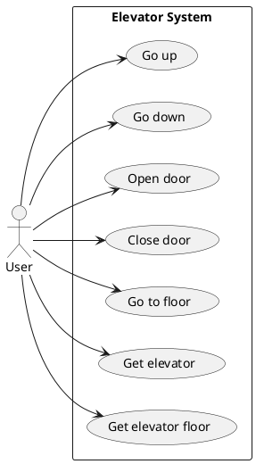
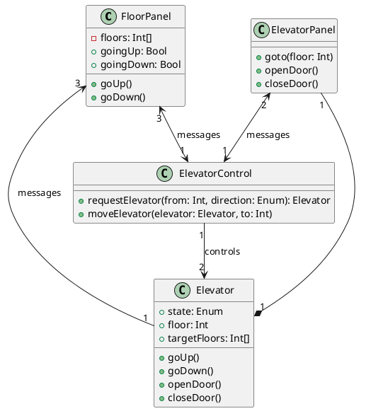
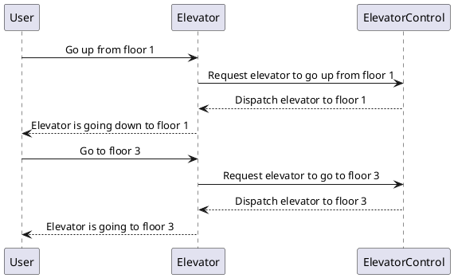

# Elevator System Requirement

## Diagrams

### Use Case Diagram

### Class Diagram

### Sequence Diagram

## Requirements

- R1: User Interface

  - R1.1: Floor Panel

    - R1.1.1: Display real-time current floor and movement direction of each elevator.

    - R1.1.2: Allow calling an elevator (Up/Down) from any floor panel.

    - R1.1.3: Indicate which elevator has been assigned to each call.

  - R1.2: Elevator (Car) Panel

    - R1.2.1: Display current floor, movement direction, and queued destinations.

    - R1.2.2: Allow selecting destination floors.

    - R1.2.3: Provide Open Door/Close Door controls.

- R2: Control Logic

  - R2.1: Elevator Operation

    - R2.1.1: Move up/down according to user requests.

    - R2.1.2: Open/close doors at floors when requested.

  - R2.2: System Dispatch

    - R2.2.1: Assign the most suitable elevator to floor calls.

    - R2.2.2: Process in-car destination requests.

    - R2.2.3: Handle concurrent requests from multiple users.

  - R2.3: Input Validation

    - R2.3.1: Ignore invalid or duplicate button presses.

- R3: Localization

  - R3.1: Support runtime switching between English and Chinese.

  - R3.2: Load all UI text from resource files.

  - R3.3: Cover localization logic with unit tests.

- R4: Theming

  - R4.1: Detect and apply OS light/dark preference on startup.

  - R4.2: Enable runtime theme toggling via the UI.

  - R4.3: Apply theme changes immediately without restart.

- R5: ZeroMQ External API

  - R5.1: Expose commands for door control, floor calls, destination selection, and reset.

  - R5.2: Publish events on door state changes and floor arrivals.

  - R5.3: Validate API behavior with integration tests.

- R6: Runtime Configuration

  - R6.1: Allow live adjustment of number of elevators, travel duration, and door timings.

  - R6.2: Provide GUI controls for updating these parameters.

  - R6.3: Apply new settings immediately to subsequent operations.

  - R6.4: Cover configuration logic with unit tests.
