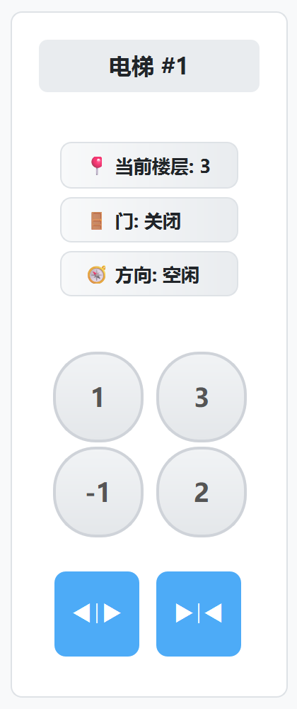
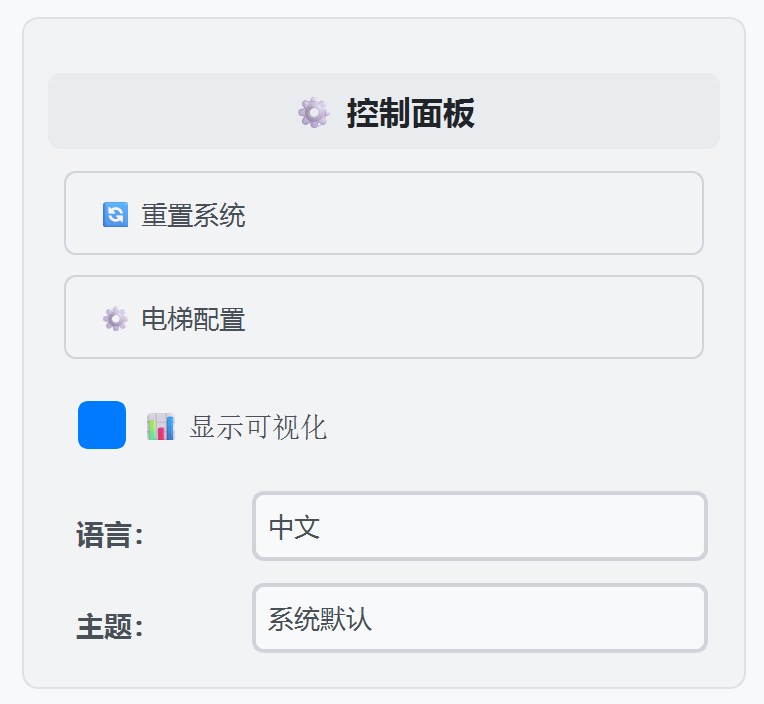

# User Manual

This manual provides comprehensive documentation for the Elevator Control System, including detailed Controller API reference and GUI operation guide. Screenshot placeholders are included for future replacement with actual interface captures.

---

## 1. Controller API Reference

### 1.1 Initialization

```python
from system.core.controller import Controller, Config
# Create controller with default configuration
ctrl = Controller()
# Or use custom configuration
cfg = Config(
    floor_travel_duration=2.5,
    door_move_duration=1.2,
    elevator_count=3,
    strategy=Strategy.GREEDY,
)
ctrl = Controller(config=cfg)
```

### 1.2 Configuration Methods

- `set_config(**kwargs)`: Dynamically modify runtime configuration.
  - Supported parameters:
    - `floor_travel_duration` (float): Time for elevator to travel between floors
    - `door_move_duration` (float): Door opening/closing duration
    - `door_stay_duration` (float): Time doors remain open
    - `elevator_count` (int): Number of elevators
    - `strategy` (Strategy): Dispatch algorithm (OPTIMAL/GREEDY)

```python
# Modify elevator count and travel speed
ctrl.set_config(elevator_count=4, floor_travel_duration=2.0)
```

### 1.3 Core Methods

- `await ctrl.start()`: Start the elevator control system and all elevators
- `await ctrl.stop()`: Stop the system and terminate all elevator tasks
- `await ctrl.reset()`: Reset system to initial state, clearing all requests

### 1.4 Message-Driven API

The system uses string-based message control via `handle_message_task` or `handle_message`:

- Send message and create async task:
  ```python
  task = ctrl.handle_message_task("call_up@2")
  await task  # Wait for message processing completion
  ```
- Direct message handling (in async environment):
  ```python
  await ctrl.handle_message("select_floor@3#1")
  ```

#### Supported Message Types

| Message Format               | Description                      |
| ---------------------------- | -------------------------------- |
| `reset`                      | Reset entire system              |
| `call_up@<floor>`            | Call elevator going up           |
| `call_down@<floor>`          | Call elevator going down         |
| `open_door#<eid>`            | Open doors of specific elevator  |
| `close_door#<eid>`           | Close doors of specific elevator |
| `select_floor@<floor>#<eid>` | Select destination floor         |

Examples:

```python
# Call elevator from floor 1 going up
await ctrl.handle_message("call_up@1")
# Select floor 3 in elevator #2
await ctrl.handle_message("select_floor@3#2")
```

---

## 2. GUI Operation Guide

### 2.1 Launching the GUI

From the project `src` directory, run the following command to start the GUI application:

```shell
uv run -m system
```

Optional parameters:

```shell
# Headless mode (no GUI)
uv run -m system --headless
# Custom elevator count and timing parameters
uv run -m system --num-elevators 4 --floor-travel-duration 2.5 --door-move-duration 1.0
```

### 2.2 Interface Layout Overview

The main window consists of four primary sections:

- **Left Panel**: Building floor call controls
- **Center Area**: Real-time 2D elevator visualization
- **Right Panel**: Elevator interior control panels
- **Bottom-Right**: System console and configuration controls


### 2.3 Building Panel (Floor Call Controls)

#### 2.3.1 Floor Call Buttons

Located on the left side, this panel displays all building floors with directional call buttons:

- **Up Button (▲)**: Request elevator to go up from this floor
- **Down Button (▼)**: Request elevator to go down from this floor
- **Floor Labels**: Display floor numbers with localized text

{ width=30% }

#### 2.3.2 Button Behavior

- **Active State**: Buttons turn highlighted when pressed (elevator called)
- **Automatic Reset**: Buttons automatically deactivate when elevator arrives
- **Visual Feedback**: Clear visual indication of active requests

### 2.4 Elevator Visualization (Center Area)

#### 2.4.1 Real-Time Animation

The central visualization shows:

- **Elevator Cars**: Animated boxes representing each elevator
- **Floor Positions**: Exact vertical positioning relative to floors
- **Door States**: Visual representation of door opening/closing
- **Movement Direction**: Arrows indicating up/down movement

{ width=40% }

#### 2.4.2 Visual Elements

- **Elevator Colors**: Different colors for each elevator
- **Door Animation**: Smooth opening/closing transitions
- **Position Tracking**: Real-time position updates during movement
- **Status Indicators**: Current floor and direction display

### 2.5 Elevator Panels (Right Side)

#### 2.5.1 Individual Elevator Controls

Each elevator has its own control panel containing:

- **Elevator Title**: "Elevator #N" header
- **Status Display**:
  - Current floor (📍 Floor: X)
  - Door state (🚪 Door: Open/Closed/Opening/Closing)
  - Movement direction (🧭 Direction: Up/Down/Idle)
- **Floor Selection Buttons**: Grid of floor buttons for destination selection
- **Door Control Buttons**: Manual door open/close controls

{ width=30% }

#### 2.5.2 Floor Selection

- **Button Grid**: All available floors displayed as clickable buttons
- **Active Selection**: Selected floors highlighted until reached
- **Automatic Deactivation**: Buttons reset when elevator arrives at destination

#### 2.5.3 Door Controls

- **Open Door Button**: Manually open elevator doors
- **Close Door Button**: Manually close elevator doors
- **State Feedback**: Real-time door status updates

### 2.6 System Controls and Console

#### 2.6.1 Control Panel

Located in the bottom-right corner:

- **Reset Button**: Reset entire elevator system to initial state
- **Configuration Button**: Open system settings dialog
- **Visualizer Toggle**: Show/hide elevator animation
- **Language Selector**: Switch between English and Chinese
- **Theme Selector**: Choose between System/Light/Dark themes

{ width=50% }

#### 2.6.2 Console Widget

Interactive command console for advanced users:

- **Command Input**: Direct message execution (e.g., "call_up@2")
- **Output Display**: System responses and status messages
- **Command History**: Previous commands and results
- **Real-time Logging**: Live system event monitoring

{ width=50% }

### 2.7 Configuration Dialog

#### 2.7.1 Accessing Settings

Click the "Configuration" button to open the settings dialog:

{ width=50% }

#### 2.7.2 Available Settings

- **Elevator Count**: Number of elevators (1-6)
- **Floor Travel Duration**: Time between floors (0.1-10.0 seconds)
- **Door Move Duration**: Door operation time (0.1-10.0 seconds)
- **Door Stay Duration**: Time doors remain open (0.1-10.0 seconds)

#### 2.7.3 Real-Time Updates

- Changes apply immediately without system restart
- Elevator count modifications update GUI dynamically
- Timing adjustments affect ongoing operations

### 2.8 Theme and Localization

#### 2.8.1 Theme Options

- **System Theme**: Dynamic follows system appearance
- **Light Theme**: Bright interface with light backgrounds
- **Dark Theme**: Dark interface optimized for low-light environments

#### 2.8.2 Language Support

- **English**: Full English interface
- **Chinese (中文)**: Complete Chinese localization
- **Runtime Switching**: Change language without restart

### 2.9 Advanced Features

#### 2.9.1 Keyboard Shortcuts

- **Enter**: Execute console command
- **Escape**: Close dialogs
- **F5**: Reset system

#### 2.9.2 Status Monitoring

- **Real-time Updates**: All status information updates live
- **Event Logging**: Console displays system events
- **Visual Feedback**: Clear indication of system state changes

#### 2.9.3 Error Handling

- **Invalid Commands**: Console shows error messages
- **System Limits**: Prevents invalid configurations
- **Graceful Recovery**: System continues operating after errors

---

### 2.10 Common Usage Scenarios

#### 2.10.1 Basic Operation

1. **Call Elevator**: Click up/down arrows on building panel
2. **Select Destination**: Click floor button in elevator panel
3. **Monitor Progress**: Watch visualization and status updates
4. **Door Control**: Use manual door buttons if needed

#### 2.10.2 System Configuration

1. **Open Settings**: Click configuration button
2. **Adjust Parameters**: Modify elevator count or timing
3. **Apply Changes**: Click OK to apply settings
4. **Verify Operation**: Test new configuration

#### 2.10.3 Advanced Console Usage

1. **Direct Commands**: Type messages like "call_up@3"
2. **Batch Operations**: Execute multiple commands
3. **System Monitoring**: Watch real-time event logs
4. **Debugging**: Use console for troubleshooting

---

## 3. Testing System Guide

The elevator control system provides a comprehensive testing framework, including unit tests, integration tests, GUI tests, and passenger simulation tests. The testing system supports automated test execution, concurrent running, and real-time result monitoring.

### 3.1 Testing Framework Overview

The testing system is based on Python's unittest framework and asyncio asynchronous programming model, providing the following features:

- **Unit Testing**: Test individual component functionality
- **Integration Testing**: Verify component interactions and overall system functionality
- **GUI Testing**: Test graphical user interface interactive behavior
- **Passenger Simulation**: Simulate real passenger usage scenarios
- **Performance Testing**: Verify system performance under concurrent load

### 3.2 Running the Testing System

#### 3.2.1 Starting the Test Runner

To launch the testing system from the project root directory, use the following commands:

```shell
# Start the interactive test selector
uv run -m testing

# Execute all tests in non-interactive mode
uv run -m testing --all

# Run specific test files
uv run -m testing --tests test_controller.py test_elevator.py

# Configure maximum concurrency for test execution
uv run -m testing --max-workers 8
```

The `testing` module provides a test runner with support for concurrent execution, while you can always use `unittest` directly for more granular control:

```shell
# Run all tests in the testing directory
uv run -m unittest discover -s testing -p test_*.py

# Run single test_function in a specific file
cd testing
uv run -m unittest test_passenger_simulation.PassengerSimulationTest.test_random_passengers
```

#### 3.2.2 Interactive Test Selection

In interactive mode, the system displays all available test scripts:

```shell
$ uv run -m testing

Available Test Scripts:

1. test_controller.py
2. test_elevator.py
3. test_elevators.py
4. test_floor.py
5. test_gui_controller.py
6. test_integration_1.py
7. test_integration_2.py
8. test_passenger.py
9. test_passenger_simulation.py
10. test_system.py
11. test_target_floors.py
12. test_target_floor_chains.py
13. test_elevator_visualizer.py

Test Selection Options:

- Enter test numbers (e.g.: 1 3 5)
- Enter 'all' to run all tests
- Enter 'exit' to quit

Please select tests to run:

```

### 3.3 Test Types Overview

#### 3.3.1 Unit Testing

**Controller Testing** (`test_controller.py`)

- Test basic controller functionality: start, stop, reset
- Verify message handling mechanisms: call_up, call_down, select_floor
- Check configuration management and state synchronization

```python
# Example: Test controller message handling
await controller.handle_message("call_up@2")
assert controller.elevators[1].current_floor == 2
```

**Elevator Testing** (`test_elevator.py`)

- Verify elevator state machine transitions
- Test door control logic
- Check floor movement and positioning accuracy

**Target Floors Testing** (`test_target_floors.py`)

- Test target floor management algorithms
- Verify floor sorting and optimization strategies
- Check floor chain scheduling logic

#### 3.3.2 Integration Testing

**GUI Integration Testing** (`test_integration_1.py`, `test_integration_2.py`)

- Test GUI component interactions with controller
- Verify button click events and state synchronization
- Check real-time interface update mechanisms

```python
# Example: Test door open button
self.elevator1_UI.open_door_button.click()
await asyncio.sleep(0.02)
assert self.elevator1.state.is_door_open()
```

**System Integration Testing** (`test_system.py`)

- Verify complete elevator system coordination
- Test multi-elevator concurrent scheduling
- Check system fault tolerance and recovery capabilities

#### 3.3.3 Passenger Simulation Testing

**Passenger Behavior Simulation** (`test_passenger.py`, `test_passenger_simulation.py`)

- Simulate real passenger usage patterns
- Test complex passenger request sequences
- Verify scheduling algorithm efficiency and fairness

**Passenger State Management**:

```python
class PassengerState(IntEnum):
    IN_ELEVATOR_AT_TARGET_FLOOR = auto()
    IN_ELEVATOR_AT_OTHER_FLOOR = auto()
    OUT_ELEVATOR_AT_TARGET_FLOOR = auto()
    OUT_ELEVATOR_AT_OTHER_FLOOR = auto()
```

### 3.4 Test Configuration and Customization

#### 3.4.1 Test Environment Configuration

The testing system uses accelerated timing parameters to improve test efficiency:

```python
controller.set_config(
    floor_travel_duration=0.2,    # Fast floor movement
    door_stay_duration=0.1,       # Brief stay duration
    door_move_duration=0.1,       # Fast door operations
)
```

#### 3.4.2 GUI Test Base Class

All GUI tests inherit from `GUIAsyncioTestCase`, providing:

- Automatic GUI environment setup and cleanup
- Controller and window instance access
- Convenient elevator component access methods

```python
class MyGUITest(GUIAsyncioTestCase):
    async def test_elevator_operation(self):
        # Access elevator 1 UI panel
        panel = self.elevator1_UI
        # Access elevator 1 control logic
        elevator = self.elevator1
```

### 3.5 Advanced Testing Scenarios

#### 3.6.1 Real-Time Test Monitoring

During test execution, a real-time status table is displayed:

```
┌─────────────────────┬────────┬────────┐
│ Test File           │ Status │ Result │
├─────────────────────┼────────┼────────┤
│ test_controller.py  │ Passed │   ✓    │
│ test_elevator.py    │ Running│        │
│ test_integration.py │ Waiting│        │
└─────────────────────┴────────┴────────┘
```

Status explanations:

- **Waiting**: Test has not started yet
- **Running**: Test is currently executing
- **Passed**: Test completed successfully
- **Failed**: Test discovered issues
- **Error**: Test execution exception
- **Aborted**: Test was interrupted by user

#### 3.6.2 Detailed Result Reports

After test completion, detailed output for each test is displayed:

```
Detailed Test Results:

┌─ test_controller.py ───────────┐
│ ..........................     │
│ ------------------------------ │
│ Ran 26 tests in 5.214s         │
│                                │
│ OK                             │
└─ Result: Passed ───────────────┘

Summary: 12/13 tests passed
```

### 3.7 Troubleshooting and Debugging

#### 3.7.1 Common Test Issues

**Timing Issues**:

```python
# Use appropriate delays to wait for async operations
await asyncio.sleep(0.02)
assert condition_is_met()
```

**GUI Test Failures**:

- Ensure using Python 3.13 or higher
- Check if GUI environment is properly initialized
- Verify async event loop setup

**Unstable Concurrent Tests**:

- Configure longer duration parameters for tests
- Adjust concurrency appropriately (`--max-workers`)

#### 3.7.2 Debugging Tips

**Enable Verbose Logging**:

```python
# Temporarily enable logging in tests
logger.setLevel("DEBUG")
```

**Run Failed Tests Individually**:

```shell
uv run -m testing --tests test_controller.py
```

**Check Test Output**:
Complete output for each test is displayed in the result report, including error messages and stack traces.

### 3.8 Testing Best Practices

#### 3.8.1 Writing New Tests

1. **Inherit from Correct Base Class**:

   - GUI tests: `GUIAsyncioTestCase`
   - General async tests: `unittest.IsolatedAsyncioTestCase`

2. **Use Descriptive Test Names**:

   ```python
   async def test_elevator_responds_to_floor_call_up(self):
   ```

3. **Set Up Appropriate Test Environment**:
   ```python
   async def asyncSetUp(self):
       await super().asyncSetUp()
       # Custom setup
   ```

#### 3.8.2 Test Coverage Areas

Ensure tests cover the following aspects:

- **Normal Operation Flow**: Standard usage scenarios
- **Boundary Conditions**: Extreme inputs and states
- **Error Handling**: Exception scenarios and recovery
- **Concurrency Safety**: Multi-threading and async operations
- **Performance Metrics**: Response time and throughput

Return codes:

- `0`: All tests passed
- `1`: Some tests failed
- Other: System error

---
